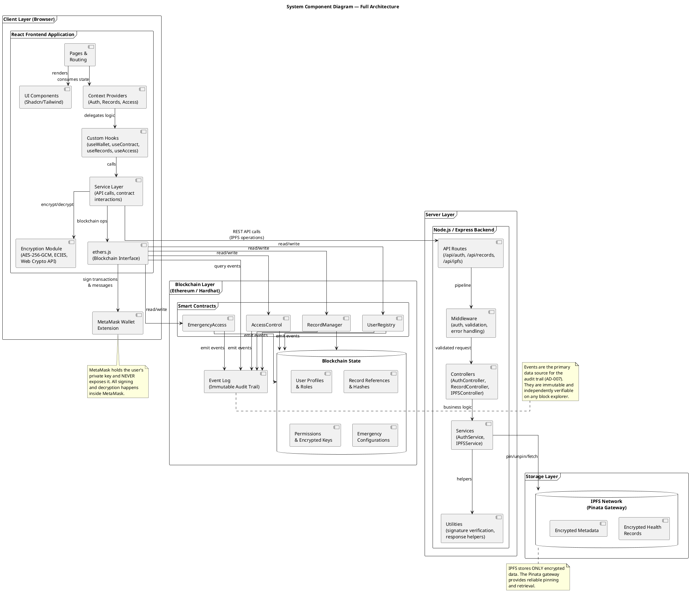
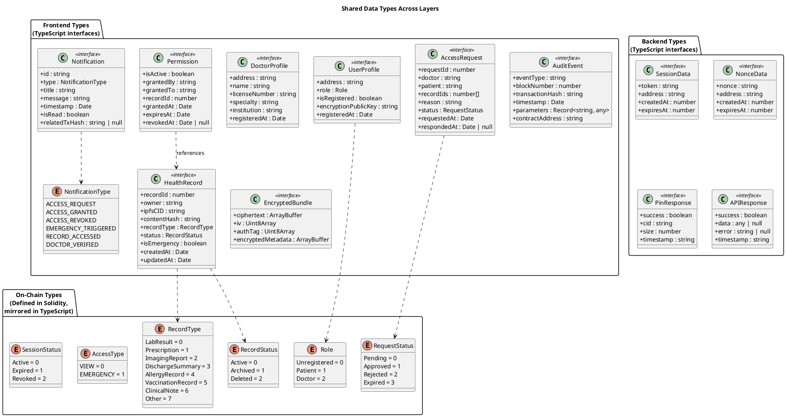
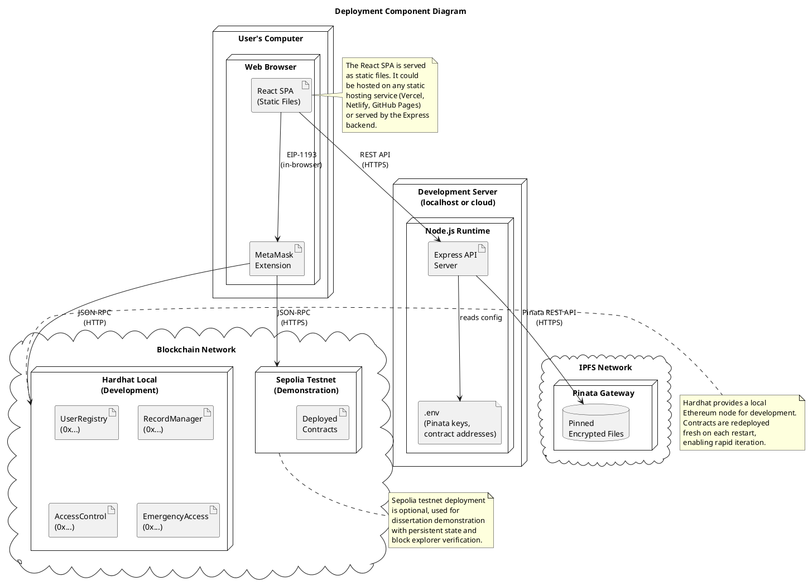

# Class Diagram & Component Diagram — Section 5.1

This section presents the structural views of the Personal Health Data Store system, covering the component architecture across all layers and detailed class diagrams for the smart contract layer, backend API layer, and frontend layer.

---

## 1. System Component Diagram (High-Level Architecture)

### Component Diagram Narrative

The system follows a **three-tier architecture** augmented with a decentralised storage and computation layer:

**Client Layer:** The React frontend application runs entirely in the user's browser. It is responsible for all user interaction, client-side encryption and decryption, and direct communication with the blockchain via ethers.js. The encryption module is architecturally isolated as a dedicated component because it handles the most security-critical operations in the system — all plaintext health data is encrypted and decrypted within this component, and plaintext never leaves the browser boundary. MetaMask serves as the cryptographic key store and transaction signer, maintaining strict separation between the application and the user's private key.

**Server Layer:** The Node.js/Express backend serves a deliberately limited role. It acts as a relay for IPFS operations (pinning and fetching encrypted files via the Pinata API) and provides authentication nonce generation and signature verification. Critically, the backend never handles plaintext health data or encryption keys. This design means that a compromised backend server cannot access patient records — it only ever sees encrypted ciphertext being relayed to IPFS.

**Storage Layer:** IPFS provides content-addressed, decentralised storage for encrypted health records. The Pinata pinning service ensures data persistence by maintaining pinned copies. Since all data stored on IPFS is encrypted before leaving the browser, the content-addressable nature of IPFS (where CIDs can be used by anyone to retrieve content) does not create a privacy risk — retrieved content is unreadable without the decryption key.

**Blockchain Layer:** The four smart contracts handle identity, record registration, access control, and emergency access. The blockchain stores only references (IPFS CIDs), integrity hashes, encrypted keys, and permissions — never the health records themselves. The event log provides an immutable audit trail that can be queried by the frontend and independently verified on any block explorer.

---

## 2. Smart Contract Class Diagram

```plantuml
@startuml Smart_Contract_Class_Diagram
title Smart Contract Class Diagram

skinparam classAttributeIconSize 0
skinparam classFontSize 11
skinparam classAttributeFontSize 10

' ──────────────────────────────────────────
'  Custom Access Control & Security Contracts
' ──────────────────────────────────────────

abstract class Ownable <<Custom Implementation>> {
    - address owner
    + owner() : address
    + onlyOwner() : modifier
    + transferOwnership(newOwner : address)
    + renounceOwnership()
    --
    Note: Custom implementation of ownership
    pattern without external dependencies
}

abstract class ReentrancyGuard <<Custom Implementation>> {
    - uint256 _status
    - uint256 constant _NOT_ENTERED = 1
    - uint256 constant _ENTERED = 2
    + nonReentrant() : modifier
    --
    Note: Prevents reentrancy attacks by tracking
    function entry state
}

abstract class Pausable <<Custom Implementation>> {
    - bool _paused
    + paused() : bool
    + whenNotPaused() : modifier
    + whenPaused() : modifier
    + pause() <<onlyOwner>>
    + unpause() <<onlyOwner>>
    --
    Note: Emergency pause mechanism with custom
    error handling
}

' ──────────────────────────────────────────
'  Interfaces
' ──────────────────────────────────────────

interface IUserRegistry {
    + registerAsPatient(encryptionPublicKey : bytes)
    + registerAsDoctor(name, license, specialty, institution, key : bytes)
    + updatePublicKey(newPublicKey : bytes)
    + getUserRole(user : address) : Role
    + isRegistered(user : address) : bool
    + getPublicKey(user : address) : bytes
    + getUserProfile(user : address) : UserProfile
    + getDoctorProfile(doctor : address) : DoctorProfile
    + isDoctorVerified(doctor : address) : bool
}

interface IRecordManager {
    + addRecord(ipfsCID, contentHash, recordType, encryptedKey) : uint256
    + archiveRecord(recordId : uint256)
    + deleteRecord(recordId : uint256)
    + restoreRecord(recordId : uint256)
    + setEmergencyFlag(recordId : uint256, isEmergency : bool)
    + storeEncryptedKey(recordId, grantee, encryptedKey)
    + removeEncryptedKey(recordId, grantee)
    + getRecord(recordId) : HealthRecord
    + getRecordsByOwner(owner) : uint256[]
    + getRecordCID(recordId) : string
    + getContentHash(recordId) : bytes32
    + getEncryptedKey(recordId, user) : bytes
    + getEmergencyRecords(owner) : uint256[]
    + isRecordActive(recordId) : bool
}

interface IAccessControl {
    + requestAccess(patient, recordIds, reason) : uint256
    + approveAccess(requestId, expiresAt, encryptedKeys)
    + grantAccess(recordId, doctor, expiresAt, encryptedKey)
    + rejectAccess(requestId : uint256)
    + revokeAccess(recordId, doctor)
    + revokeAllAccess(recordId : uint256)
    + batchRevoke(recordIds[], doctors[])
    + checkAccess(doctor, recordId) : (bool, bytes)
    + logAccess(recordId, accessType)
    + getSharedRecords(doctor) : uint256[]
    + getPermissionsForRecord(recordId) : Permission[]
    + getPermissionsByOwner(patient) : Permission[]
    + getPendingRequests(patient) : AccessRequest[]
}

interface IEmergencyAccess {
    + triggerEmergencyAccess(patient) : uint256
    + issueEmergencyOTP(sessionId, encryptedOTP : bytes)
    + getEmergencyRecordsOTP(patient, sessionId) : (uint256[], bytes)
    + revokeEmergencySession(sessionId : uint256)
    + getSession(sessionId) : EmergencySession
}

' ──────────────────────────────────────────
'  Core Contract Implementations
' ──────────────────────────────────────────

class UserRegistry {
    __ Enums __
    {field} Role { Unregistered, Patient, Doctor }
    __ Structs __
    {field} UserProfile { role, isRegistered, encryptionPublicKey, registeredAt }
    {field} DoctorProfile { name, licenseNumber, specialty, institution, registeredAt }
    __ State Variables __
    - mapping(address => UserProfile) users
    - mapping(address => DoctorProfile) doctors
    - uint256 totalUsers
    - uint256 totalDoctors
    __ Modifiers __
    + onlyUnregistered()
    + onlyRegistered()
    __ Events __
    ~ UserRegistered(address, Role, uint256)
    ~ PublicKeyUpdated(address, uint256)
    __ Functions __
    + registerAsPatient(bytes)
    + registerAsDoctor(string, string, string, string, bytes)
    + updatePublicKey(bytes)
    + getUserRole(address) : Role <<view>>
    + isRegistered(address) : bool <<view>>
    + getPublicKey(address) : bytes <<view>>
    + getUserProfile(address) : UserProfile <<view>>
    + getDoctorProfile(address) : DoctorProfile <<view>>
    + isDoctorVerified(address) : bool <<view>>
    + pause() <<onlyOwner>>
    + unpause() <<onlyOwner>>
}

class RecordManager {
    __ Enums __
    {field} RecordType { LabResult, Prescription, ImagingReport, DischargeSummary, AllergyRecord, VaccinationRecord, ClinicalNote, Other }
    {field} RecordStatus { Active, Archived, Deleted }
    __ Structs __
    {field} HealthRecord { recordId, owner, ipfsCID, contentHash, recordType, status, isEmergency, createdAt, updatedAt }
    __ State Variables __
    - IUserRegistry userRegistry
    - address authorisedAccessControl
    - address authorisedEmergencyAccess
    - mapping(uint256 => HealthRecord) records
    - mapping(address => uint256[]) ownerRecords
    - mapping(uint256 => mapping(address => bytes)) encryptedKeys
    - uint256 nextRecordId
    __ Modifiers __
    + onlyPatient()
    + onlyRecordOwner(uint256)
    + recordIsActive(uint256)
    + recordExists(uint256)
    + onlyAuthorised()
    __ Events __
    ~ RecordAdded(uint256, address, string, RecordType, uint256)
    ~ RecordArchived(uint256, address, uint256)
    ~ RecordDeleted(uint256, address, uint256)
    ~ RecordRestored(uint256, address, uint256)
    ~ EmergencyFlagUpdated(uint256, address, bool, uint256)
    __ Functions __
    + constructor(address userRegistryAddr)
    + setAuthorisedCaller(address accessControlAddr) <<onlyOwner>>
    + setEmergencyContract(address emergencyAddr) <<onlyOwner>>
    + addRecord(string, bytes32, RecordType, bytes) : uint256
    + archiveRecord(uint256)
    + deleteRecord(uint256)
    + restoreRecord(uint256)
    + setEmergencyFlag(uint256, bool)
    + storeEncryptedKey(uint256, address, bytes) <<onlyAuthorised>>
    + removeEncryptedKey(uint256, address) <<onlyAuthorised>>
    + getRecord(uint256) : HealthRecord <<view>>
    + getRecordsByOwner(address) : uint256[] <<view>>
    + getRecordCID(uint256) : string <<view>>
    + getContentHash(uint256) : bytes32 <<view>>
    + getEncryptedKey(uint256, address) : bytes <<view>>
    + getEmergencyRecords(address) : uint256[] <<view>>
    + isRecordActive(uint256) : bool <<view>>
    + getRecordCount() : uint256 <<view>>
}

class AccessControl {
    __ Enums __
    {field} RequestStatus { Pending, Approved, Rejected, Expired }
    {field} AccessType { VIEW, EMERGENCY }
    __ Structs __
    {field} AccessRequest { requestId, doctor, patient, recordIds, reason, status, requestedAt, respondedAt }
    {field} Permission { isActive, grantedBy, grantedTo, recordId, grantedAt, expiresAt, revokedAt }
    __ State Variables __
    - IUserRegistry userRegistry
    - IRecordManager recordManager
    - mapping(uint256 => AccessRequest) requests
    - mapping(uint256 => mapping(address => Permission)) permissions
    - mapping(address => uint256[]) doctorSharedRecords
    - mapping(address => uint256[]) patientPermissionRecords
    - mapping(address => uint256[]) patientIncomingRequests
    - mapping(address => uint256[]) doctorOutgoingRequests
    - uint256 nextRequestId
    __ Modifiers __
    + onlyVerifiedDoctor()
    + onlyRequestPatient(uint256)
    __ Events __
    ~ AccessRequested(uint256, address, address, uint256[], string, uint256)
    ~ AccessGranted(uint256, address, address, uint256, uint256)
    ~ AccessRevoked(uint256, address, address, uint256)
    ~ AccessRequestRejected(uint256, address, address, uint256)
    ~ RecordAccessed(uint256, address, address, AccessType, uint256)
    __ Functions __
    + constructor(address userRegistryAddr, address recordManagerAddr)
    + requestAccess(address, uint256[], string) : uint256
    + approveAccess(uint256, uint256, bytes[])
    + grantAccess(uint256, address, uint256, bytes)
    + rejectAccess(uint256)
    + revokeAccess(uint256, address)
    + revokeAllAccess(uint256)
    + batchRevoke(uint256[], address[])
    + checkAccess(address, uint256) : (bool, bytes) <<view>>
    + logAccess(uint256, AccessType)
    + getSharedRecords(address) : uint256[] <<view>>
    + getPermissionsForRecord(uint256) : Permission[] <<view>>
    + getPermissionsByOwner(address) : Permission[] <<view>>
    + getPendingRequests(address) : AccessRequest[] <<view>>
    + getRequestsByDoctor(address) : AccessRequest[] <<view>>
    + getRequestCount() : uint256 <<view>>
}

class EmergencyAccess {
    __ Enums __
    {field} SessionStatus { Active, Expired, Revoked }
    __ Structs __
    {field} EmergencySession { sessionId, patient, doctor, status, startedAt, expiresAt, recordsAccessed }
    __ State Variables __
    - IUserRegistry userRegistry
    - IRecordManager recordManager
    - IAccessControl accessControl
    - mapping(uint256 => EmergencySession) sessions
    - mapping(uint256 => bytes) issuedOTPs
    - uint256 nextSessionId
    - uint256 constant DEFAULT_SESSION = 86400
    __ Modifiers __
    + sessionActive(uint256)
    __ Events __
    ~ EmergencyAccessTriggered(uint256, address, address, uint256, uint256)
    ~ EmergencyRecordAccessed(uint256, uint256, address, uint256)
    ~ EmergencySessionRevoked(uint256, address, uint256)
    ~ EmergencyOTPIssued(uint256)
    __ Functions __
    + constructor(address urAddr, address rmAddr, address acAddr)
    + triggerEmergencyAccess(address) : uint256
    + issueEmergencyOTP(uint256, bytes)
    + getEmergencyRecordsOTP(address, uint256) : (uint256[], bytes)
    + revokeEmergencySession(uint256)
    + getSession(uint256) : EmergencySession <<view>>
    + getSessionsByPatient(address) : EmergencySession[] <<view>>
}

' ──────────────────────────────────────────
'  Inheritance Relationships
' ──────────────────────────────────────────

Ownable <|-- UserRegistry
Pausable <|-- UserRegistry
IUserRegistry <|.. UserRegistry

Ownable <|-- RecordManager
ReentrancyGuard <|-- RecordManager
Pausable <|-- RecordManager
IRecordManager <|.. RecordManager

Ownable <|-- AccessControl
ReentrancyGuard <|-- AccessControl
IAccessControl <|.. AccessControl

Ownable <|-- EmergencyAccess
ReentrancyGuard <|-- EmergencyAccess
IEmergencyAccess <|.. EmergencyAccess

' ──────────────────────────────────────────
'  Dependencies (uses relationships)
' ──────────────────────────────────────────

RecordManager ..> IUserRegistry : <<uses>>\nverifies roles
AccessControl ..> IUserRegistry : <<uses>>\nverifies roles & keys
AccessControl ..> IRecordManager : <<uses>>\nvalidates records,\nstores keys
EmergencyAccess ..> IUserRegistry : <<uses>>\nverifies doctors
EmergencyAccess ..> IRecordManager : <<uses>>\nreads emergency flags
EmergencyAccess ..> IAccessControl : <<uses>>\ntemporary permissions

@enduml
```

### Smart Contract Class Diagram Narrative

The smart contract class diagram reveals the system's inheritance hierarchy, interface implementation, and dependency structure. Four core contracts implement four corresponding interfaces, with shared infrastructure provided by custom implementations of common security patterns.

**Inheritance hierarchy:** Each contract inherits from custom implementations of `Ownable` (providing administrative functions), and contracts that modify critical state additionally inherit from `ReentrancyGuard` (preventing reentrancy attacks) and `Pausable` (enabling emergency stops). These patterns are implemented directly within the contract codebase rather than imported from external libraries. `UserRegistry` and `RecordManager` include `Pausable` because they manage the system's foundational data — pausing these contracts effectively freezes all system operations, which is appropriate for responding to discovered vulnerabilities.

**Custom implementation rationale:** Rather than depending on external libraries, the contracts implement these patterns directly. This provides educational clarity for the dissertation scope, reduces external dependencies, and allows custom error messages tailored to the application's context. The implementations follow established security patterns: ownership uses an `owner` address with `onlyOwner` modifier, reentrancy protection tracks function entry state, and pausing uses a boolean flag with appropriate modifiers.

**Interface implementation:** Each core contract implements a corresponding interface (`IUserRegistry`, `IRecordManager`, `IAccessControl`, `IEmergencyAccess`). This separation enables inter-contract communication through interface types rather than concrete types, following the Dependency Inversion Principle. When `AccessControl` queries `RecordManager`, it does so through the `IRecordManager` interface, meaning the actual `RecordManager` implementation could be replaced without modifying `AccessControl` — provided the replacement implements the same interface.

**Dependency direction:** Dependencies flow strictly in one direction with no circular references. `UserRegistry` has no dependencies on other application contracts. `RecordManager` depends only on `UserRegistry`. `AccessControl` depends on both `UserRegistry` and `RecordManager`. `EmergencyAccess` depends on all three. This layered dependency structure ensures that lower-level contracts can be developed and tested independently, and that changes to higher-level contracts do not cascade downward.

---

## 3. Backend API Class Diagram

```plantuml
@startuml Backend_Class_Diagram
title Backend API Layer — Class Diagram

skinparam classAttributeIconSize 0
skinparam classFontSize 11

package "Routes" {
    class AuthRoutes {
        + POST /api/auth/nonce
        + POST /api/auth/verify
        + POST /api/auth/logout
        --
        - router : express.Router
        + registerRoutes() : Router
    }

    class RecordRoutes {
        + POST /api/records/upload
        + GET /api/records/:cid
        + DELETE /api/records/:cid
        --
        - router : express.Router
        + registerRoutes() : Router
    }

    class IPFSRoutes {
        + POST /api/ipfs/pin
        + GET /api/ipfs/:cid
        + DELETE /api/ipfs/unpin/:cid
        --
        - router : express.Router
        + registerRoutes() : Router
    }
}

package "Middleware" {
    class AuthMiddleware {
        + verifySession(req, res, next)
        + verifyWalletSignature(req, res, next)
        + extractWalletAddress(req, res, next)
        --
        - sessionStore : Map<string, SessionData>
    }

    class ValidationMiddleware {
        + validateUploadRequest(req, res, next)
        + validateCID(req, res, next)
        + sanitizeInputs(req, res, next)
        --
        - allowedFileTypes : string[]
        - maxFileSize : number
    }

    class ErrorMiddleware {
        + globalErrorHandler(err, req, res, next)
        + notFoundHandler(req, res, next)
        --
        - logError(error : Error)
        - formatErrorResponse(error) : object
    }

    class CORSMiddleware {
        + configureCORS(req, res, next)
        --
        - allowedOrigins : string[]
    }

    class RateLimiter {
        + limitRequests(req, res, next)
        --
        - windowMs : number
        - maxRequests : number
        - store : Map<string, RequestCount>
    }
}

package "Controllers" {
    class AuthController {
        - authService : AuthService
        --
        + getNonce(req, res) : Response
        + verifySignature(req, res) : Response
        + logout(req, res) : Response
    }

    class RecordController {
        - ipfsService : IPFSService
        --
        + uploadRecord(req, res) : Response
        + getRecord(req, res) : Response
        + deleteRecord(req, res) : Response
    }

    class IPFSController {
        - ipfsService : IPFSService
        --
        + pinFile(req, res) : Response
        + getFile(req, res) : Response
        + unpinFile(req, res) : Response
    }
}

package "Services" {
    class AuthService {
        - nonceStore : Map<string, NonceData>
        - sessionStore : Map<string, SessionData>
        --
        + generateNonce(address : string) : string
        + verifySignature(address, signature, nonce) : boolean
        + createSession(address : string) : string
        + validateSession(token : string) : SessionData
        + invalidateSession(token : string) : void
        - recoverAddress(message, signature) : string
        - isNonceValid(address, nonce) : boolean
        - cleanExpiredNonces() : void
    }

    class IPFSService {
        - pinataApiKey : string
        - pinataSecretKey : string
        - pinataGateway : string
        --
        + pinFile(fileBuffer : Buffer, metadata : object) : PinResponse
        + getFile(cid : string) : Buffer
        + unpinFile(cid : string) : UnpinResponse
        + testConnection() : boolean
        - buildPinataHeaders() : object
        - validateCID(cid : string) : boolean
    }

    class NonceData <<struct>> {
        + nonce : string
        + address : string
        + createdAt : number
        + expiresAt : number
    }

    class SessionData <<struct>> {
        + token : string
        + address : string
        + createdAt : number
        + expiresAt : number
    }

    class PinResponse <<struct>> {
        + success : boolean
        + cid : string
        + size : number
        + timestamp : string
    }
}

package "Utilities" {
    class SignatureUtils {
        + {static} recoverAddress(message, signature) : string
        + {static} hashMessage(message : string) : string
        + {static} isValidAddress(address : string) : boolean
    }

    class ResponseHelper {
        + {static} success(res, data, status?) : Response
        + {static} error(res, message, status?) : Response
        + {static} validationError(res, errors) : Response
    }

    class Logger {
        + {static} info(message : string, meta? : object)
        + {static} warn(message : string, meta? : object)
        + {static} error(message : string, error? : Error)
        + {static} debug(message : string, meta? : object)
    }
}

package "Configuration" {
    class Config {
        + {static} PORT : number
        + {static} PINATA_API_KEY : string
        + {static} PINATA_SECRET_KEY : string
        + {static} PINATA_GATEWAY : string
        + {static} CORS_ORIGIN : string
        + {static} SESSION_DURATION : number
        + {static} NONCE_EXPIRY : number
        + {static} MAX_FILE_SIZE : number
        + {static} RATE_LIMIT_WINDOW : number
        + {static} RATE_LIMIT_MAX : number
        --
        + {static} validate() : void
        + {static} load() : Config
    }
}

class App <<entry point>> {
    - app : express.Application
    --
    + configureMiddleware()
    + registerRoutes()
    + startServer(port : number)
}

' Relationships
App --> AuthRoutes : registers
App --> RecordRoutes : registers
App --> IPFSRoutes : registers
App --> CORSMiddleware : uses
App --> ErrorMiddleware : uses
App --> RateLimiter : uses
App --> Config : reads

AuthRoutes --> AuthMiddleware : pipeline
AuthRoutes --> AuthController : delegates
RecordRoutes --> AuthMiddleware : pipeline
RecordRoutes --> ValidationMiddleware : pipeline
RecordRoutes --> RecordController : delegates
IPFSRoutes --> AuthMiddleware : pipeline
IPFSRoutes --> IPFSController : delegates

AuthController --> AuthService : uses
RecordController --> IPFSService : uses
IPFSController --> IPFSService : uses

AuthService --> SignatureUtils : uses
AuthService --> Logger : uses
IPFSService --> Logger : uses

AuthController --> ResponseHelper : uses
RecordController --> ResponseHelper : uses
IPFSController --> ResponseHelper : uses

@enduml
```

### Backend Class Diagram Narrative

The backend follows the **MVC (Model-View-Controller)** architectural pattern adapted for an API server (without the View layer, which is handled by the React frontend). The design emphasises the backend's deliberately limited role: it serves as an authentication helper and IPFS relay, never handling plaintext health data.

**Routes layer:** Three route modules handle authentication (`/api/auth`), record operations (`/api/records`), and direct IPFS operations (`/api/ipfs`). Each route module creates an Express Router instance and registers its endpoints, keeping route definitions separate from business logic.

**Middleware layer:** The middleware pipeline applies cross-cutting concerns to all requests. `AuthMiddleware` verifies session tokens and extracts wallet addresses from verified sessions. `ValidationMiddleware` enforces input constraints (file type allowlists, size limits, CID format validation) before requests reach controllers. `RateLimiter` prevents abuse by limiting requests per wallet address per time window. `ErrorMiddleware` provides consistent error formatting and logging across all endpoints. These middleware components are applied in a specific order via the Express middleware pipeline, ensuring that authentication precedes validation, which precedes business logic.

**Controllers layer:** Controllers receive validated requests from the middleware pipeline and delegate to service classes. They handle HTTP-specific concerns (request parsing, response formatting, status codes) but contain no business logic. This separation means the service layer can be tested independently of HTTP concerns.

**Services layer:** `AuthService` implements the nonce-based authentication flow — generating cryptographic nonces, verifying wallet signatures using `ecrecover`, and managing ephemeral sessions. `IPFSService` encapsulates all Pinata API interactions, providing a clean interface for pinning, fetching, and unpinning files. Both services use the `Logger` utility for structured logging that aids debugging without exposing sensitive data.

**Security note:** The `AuthService` uses in-memory stores for nonces and sessions (JavaScript `Map` objects) rather than a database. This is appropriate for the dissertation scope, where the backend handles a limited number of concurrent users. In production, these would be replaced with Redis or a similar distributed store. Nonces have a short expiry (5 minutes by default) to prevent replay attacks.

---

## 4. Frontend Class Diagram

```plantuml
@startuml Frontend_Class_Diagram
title Frontend Application — Class Diagram

skinparam classAttributeIconSize 0
skinparam classFontSize 10
skinparam classAttributeFontSize 9

package "Pages (Route Components)" {
    class LandingPage {
        + render() : JSX
        - handleConnectWallet()
    }

    class PatientDashboard {
        + render() : JSX
        - loadRecords()
        - loadNotifications()
    }

    class DoctorDashboard {
        + render() : JSX
        - loadSharedRecords()
        - loadPendingRequests()
    }

    class UploadRecordPage {
        + render() : JSX
        - handleFileSelect(file : File)
        - handleMetadataInput(metadata)
        - handleUpload()
    }

    class RecordViewPage {
        + render() : JSX
        - loadAndDecryptRecord(recordId)
        - verifyIntegrity(ciphertext, hash)
    }

    class ManageAccessPage {
        + render() : JSX
        - loadPermissions()
        - handleGrant(doctor, recordId, duration)
        - handleRevoke(doctor, recordId)
    }

    class AccessRequestsPage {
        + render() : JSX
        - loadPendingRequests()
        - handleApprove(requestId, duration)
        - handleReject(requestId)
    }

    class EmergencySettingsPage {
        + render() : JSX
        - loadEmergencyConfig()
        - handleConfigureContacts(contacts[])
        - handleTagRecords(recordIds[])
    }

    class EmergencyAccessPage {
        + render() : JSX
        - handleTriggerEmergency(patientAddress)
        - loadEmergencyRecords(sessionId)
    }

    class AuditTrailPage {
        + render() : JSX
        - loadEvents()
        - filterEvents(filters)
        - sortByTimestamp()
    }

    class CustodianPage {
        + render() : JSX
        - loadPendingDoctors()
        - handleVerify(doctorAddress)
        - handleReject(doctorAddress, reason)
    }
}

package "Context Providers (React Context API)" {
    class AuthContext <<Provider>> {
        + walletAddress : string | null
        + role : Role | null
        + isConnected : boolean
        + isAuthenticated : boolean
        + sessionToken : string | null
        --
        + connectWallet() : Promise<void>
        + disconnectWallet() : void
        + authenticate() : Promise<void>
    }

    class RecordContext <<Provider>> {
        + records : HealthRecord[]
        + isLoading : boolean
        + error : string | null
        --
        + loadRecords() : Promise<void>
        + uploadRecord(file, metadata) : Promise<RecordId>
        + archiveRecord(recordId) : Promise<void>
        + deleteRecord(recordId) : Promise<void>
        + restoreRecord(recordId) : Promise<void>
    }

    class AccessContext <<Provider>> {
        + permissions : Permission[]
        + pendingRequests : AccessRequest[]
        + sharedRecords : uint256[]
        + isLoading : boolean
        --
        + loadPermissions() : Promise<void>
        + grantAccess(recordId, doctor, expiry, key) : Promise<void>
        + revokeAccess(recordId, doctor) : Promise<void>
        + requestAccess(patient, recordIds, reason) : Promise<void>
        + approveRequest(requestId, expiry, keys) : Promise<void>
        + rejectRequest(requestId) : Promise<void>
    }

    class NotificationContext <<Provider>> {
        + notifications : Notification[]
        + unreadCount : number
        --
        + loadNotifications() : Promise<void>
        + markAsRead(notificationId) : void
        + clearAll() : void
    }
}

package "Custom Hooks" {
    class useWallet <<hook>> {
        + address : string | null
        + isConnected : boolean
        + provider : ethers.BrowserProvider
        + signer : ethers.Signer
        --
        + connect() : Promise<string>
        + disconnect() : void
        + getEncryptionPublicKey() : Promise<string>
        + signMessage(message) : Promise<string>
        + decryptData(encryptedData) : Promise<string>
    }

    class useContract <<hook>> {
        + userRegistry : ethers.Contract
        + recordManager : ethers.Contract
        + accessControl : ethers.Contract
        + emergencyAccess : ethers.Contract
        + isReady : boolean
        --
        + getContract(name : string) : Contract
        + callViewFunction(contract, method, args) : Promise<any>
        + sendTransaction(contract, method, args) : Promise<Receipt>
    }

    class useRecords <<hook>> {
        + records : HealthRecord[]
        + isLoading : boolean
        + error : string | null
        --
        + fetchRecords() : Promise<void>
        + fetchRecordById(id) : Promise<HealthRecord>
        + fetchSharedRecords() : Promise<HealthRecord[]>
        + fetchEmergencyRecords() : Promise<HealthRecord[]>
    }

    class useAccess <<hook>> {
        + permissions : Permission[]
        + requests : AccessRequest[]
        --
        + fetchPermissions() : Promise<void>
        + fetchRequests() : Promise<void>
        + checkAccess(doctor, recordId) : Promise<boolean>
    }

    class useAuditTrail <<hook>> {
        + events : AuditEvent[]
        + isLoading : boolean
        --
        + fetchAllEvents(address) : Promise<void>
        + filterByType(eventType) : AuditEvent[]
        + filterByDateRange(from, to) : AuditEvent[]
        + filterByRecord(recordId) : AuditEvent[]
    }

    class useEncryption <<hook>> {
        + encrypt(file, publicKey) : Promise<EncryptedBundle>
        + decrypt(bundle, privateKey) : Promise<File>
        + generateAESKey() : Promise<CryptoKey>
        + encryptAESKey(aesKey, publicKey) : Promise<bytes>
        + decryptAESKey(encryptedKey) : Promise<CryptoKey>
        + computeHash(data) : Promise<bytes32>
        + verifyIntegrity(data, hash) : Promise<boolean>
    }
}

package "Services (API & Blockchain Interaction)" {
    class AuthAPI {
        + {static} getNonce(address) : Promise<string>
        + {static} verifySignature(address, signature, nonce) : Promise<SessionToken>
        + {static} logout(token) : Promise<void>
    }

    class IPFSAPI {
        + {static} uploadEncryptedFile(encryptedBundle) : Promise<CID>
        + {static} fetchEncryptedFile(cid) : Promise<EncryptedBundle>
        + {static} unpinFile(cid) : Promise<void>
    }

    class ContractService {
        - provider : ethers.BrowserProvider
        - signer : ethers.Signer
        --
        + getUserRegistry() : Contract
        + getRecordManager() : Contract
        + getAccessControl() : Contract
        + getEmergencyAccess() : Contract
        - getContractInstance(address, abi) : Contract
    }

    class EventService {
        - provider : ethers.BrowserProvider
        --
        + queryRecordAddedEvents(ownerFilter) : Promise<Event[]>
        + queryAccessGrantedEvents(patientFilter) : Promise<Event[]>
        + queryAccessRevokedEvents(patientFilter) : Promise<Event[]>
        + queryRecordAccessedEvents(ownerFilter) : Promise<Event[]>
        + queryEmergencyEvents(patientFilter) : Promise<Event[]>
        + queryAllEventsForUser(address) : Promise<Event[]>
        - parseEventData(rawEvent) : AuditEvent
    }
}

package "Encryption Module" {
    class EncryptionService {
        + {static} generateAESKey() : Promise<CryptoKey>
        + {static} encryptFile(file, aesKey) : Promise<EncryptedBundle>
        + {static} decryptFile(bundle, aesKey) : Promise<ArrayBuffer>
        + {static} encryptAESKeyWithPublicKey(aesKey, pubKey) : Promise<Uint8Array>
        + {static} computeContentHash(ciphertext) : string
        + {static} verifyContentHash(ciphertext, expectedHash) : boolean
    }

    class EncryptedBundle <<data class>> {
        + ciphertext : ArrayBuffer
        + iv : Uint8Array
        + authTag : Uint8Array
        + encryptedMetadata : ArrayBuffer
    }

    class MetaMaskCrypto {
        + {static} getEncryptionPublicKey(address) : Promise<string>
        + {static} encryptForRecipient(data, publicKey) : string
        + {static} decryptWithPrivateKey(encryptedData) : Promise<string>
    }

    EncryptionService --> EncryptedBundle : creates
    EncryptionService --> MetaMaskCrypto : delegates ECIES
}

package "UI Components (Reusable)" {
    class WalletConnectButton {
        + isConnected : boolean
        + address : string
        + onConnect() : void
        + onDisconnect() : void
    }

    class RecordCard {
        + record : HealthRecord
        + onView(recordId) : void
        + onManageAccess(recordId) : void
        + onArchive(recordId) : void
    }

    class PermissionRow {
        + permission : Permission
        + onRevoke(recordId, doctor) : void
    }

    class AccessRequestCard {
        + request : AccessRequest
        + onApprove(requestId) : void
        + onReject(requestId) : void
    }

    class FileUploader {
        + allowedTypes : string[]
        + maxSize : number
        + onFileSelected(file) : void
    }

    class RecordViewer {
        + fileType : string
        + fileData : ArrayBuffer
        + metadata : object
        --
        + renderPDF() : JSX
        + renderImage() : JSX
        + renderFHIR() : JSX
        + renderDownload() : JSX
    }

    class AuditTimeline {
        + events : AuditEvent[]
        + filters : FilterOptions
        + onFilterChange(filters) : void
    }

    class EmergencyBanner {
        + hasEmergencyAccess : boolean
        + sessionExpiry : Date
    }

    class TransactionStatus {
        + status : 'pending' | 'confirmed' | 'failed'
        + txHash : string
        + onViewExplorer() : void
    }

    class NotificationBell {
        + unreadCount : number
        + onClick() : void
    }
}

' ──────────────────────────────────────────
'  Key Relationships
' ──────────────────────────────────────────

' Pages use Contexts
PatientDashboard ..> AuthContext : consumes
PatientDashboard ..> RecordContext : consumes
PatientDashboard ..> NotificationContext : consumes
DoctorDashboard ..> AuthContext : consumes
DoctorDashboard ..> AccessContext : consumes
UploadRecordPage ..> RecordContext : consumes
UploadRecordPage ..> AuthContext : consumes
RecordViewPage ..> RecordContext : consumes
RecordViewPage ..> AccessContext : consumes
ManageAccessPage ..> AccessContext : consumes
AccessRequestsPage ..> AccessContext : consumes
EmergencySettingsPage ..> AuthContext : consumes
AuditTrailPage ..> AuthContext : consumes
AdminPage ..> AuthContext : consumes

' Contexts use Hooks
AuthContext --> useWallet : delegates
AuthContext --> useContract : delegates
RecordContext --> useRecords : delegates
RecordContext --> useEncryption : delegates
AccessContext --> useAccess : delegates
AccessContext --> useEncryption : delegates

' Hooks use Services
useWallet --> ContractService : creates contracts
useRecords --> ContractService : reads blockchain
useAccess --> ContractService : reads blockchain
useAuditTrail --> EventService : queries events
useEncryption --> EncryptionService : crypto ops

' Pages use Components
PatientDashboard --> RecordCard : renders
PatientDashboard --> NotificationBell : renders
DoctorDashboard --> RecordCard : renders
DoctorDashboard --> AccessRequestCard : renders
UploadRecordPage --> FileUploader : renders
RecordViewPage --> RecordViewer : renders
ManageAccessPage --> PermissionRow : renders
AccessRequestsPage --> AccessRequestCard : renders
AuditTrailPage --> AuditTimeline : renders

@enduml
```

### Frontend Class Diagram Narrative

The frontend architecture follows React's modern patterns: **functional components with hooks**, the **Context API for state management**, and a **service layer for external communication**. The design is organised into six clear layers, each with a distinct responsibility.

**Pages layer:** Each page component corresponds to a route in the application and represents a complete user-facing screen. Pages are responsible for composing UI components and connecting them to the appropriate context providers. They contain page-level logic (e.g., which data to load on mount) but delegate business logic to contexts and hooks. The ten page components map directly to the user stories and use cases identified in the requirements.

**Context Providers layer:** Four context providers manage the application's global state using React's Context API. `AuthContext` manages wallet connection, authentication, and role state — it is the foundational context that all other contexts depend upon. `RecordContext` manages the patient's health records, including upload, archive, and delete operations. `AccessContext` manages permissions, access requests, and sharing operations. `NotificationContext` manages in-app notifications derived from blockchain events. This separation ensures that state updates in one domain (e.g., access revocation) do not trigger unnecessary re-renders in unrelated domains (e.g., record listing).

**Custom Hooks layer:** Hooks encapsulate reusable logic that can be shared across components. `useWallet` abstracts MetaMask interaction, providing a clean interface for connecting, signing, and decrypting. `useContract` manages ethers.js contract instances, ensuring contracts are properly initialised with the current signer. `useRecords` and `useAccess` provide data-fetching logic for their respective domains. `useAuditTrail` encapsulates the complex event querying and aggregation logic for the audit trail. `useEncryption` wraps the encryption service in a hook interface, managing the lifecycle of cryptographic operations including key generation, encryption, decryption, and integrity verification.

**Services layer:** Services handle all external communication. `AuthAPI` and `IPFSAPI` communicate with the backend via REST calls. `ContractService` creates and manages ethers.js contract instances using the deployed contract addresses and ABIs. `EventService` queries blockchain event logs for the audit trail, handling the filtering, pagination, and parsing of raw event data into structured `AuditEvent` objects. This layer isolates external dependencies, making the hooks and contexts testable with mocked services.

**Encryption Module:** The `EncryptionService` class implements AES-256-GCM encryption and decryption using the Web Crypto API, content hash computation using keccak256, and integrity verification. `MetaMaskCrypto` provides a clean interface to MetaMask's encryption capabilities: obtaining the user's encryption public key (`eth_getEncryptionPublicKey`), encrypting data for a specific recipient using their public key, and decrypting data using the user's own private key (`eth_decrypt`). This module is the security boundary of the system — all plaintext health data is processed exclusively within this module and the browser's memory.

**UI Components layer:** Reusable presentational components handle rendering and user interaction without containing business logic. `RecordCard` displays a health record summary with action buttons. `PermissionRow` shows a permission entry with a revoke button. `FileUploader` handles drag-and-drop file selection with type and size validation. `RecordViewer` renders decrypted files based on their MIME type — PDF files in an embedded viewer, images with zoom controls, FHIR JSON in a structured medical data format, and other types as downloadable files. `TransactionStatus` provides real-time feedback on blockchain transaction progress, showing pending, confirmed, and failed states with links to the block explorer.

---

## 5. Data Type Definitions (Shared Types)

### Data Types Narrative

The data type definitions establish a consistent type system across all three layers of the application. The on-chain types (Solidity enums) are the authoritative source, and the frontend TypeScript interfaces mirror their structure exactly. This ensures that data decoded from smart contract calls maps directly to the frontend's type system without transformation ambiguity.

The enum values are explicitly numbered to match their Solidity counterparts (where `enum` values are implicitly numbered from 0). This explicit numbering prevents misalignment errors — for example, if a contract returns `2` for a user's role, the frontend correctly interprets this as `Doctor` because both the Solidity and TypeScript enums assign `2` to the `Doctor` variant.

The `AuditEvent` type uses a generic `parameters` field (`Record<string, any>`) because different event types carry different parameters. While this sacrifices some type safety, it provides the flexibility needed for the audit trail aggregation feature (AD-007) where events from multiple contracts with different schemas are displayed in a unified timeline.

The `EncryptedBundle` type appears in both the frontend encryption module and the IPFS API service, representing the standardised format for encrypted health records. This consistency ensures that what the encryption module produces is exactly what the IPFS service expects, and what IPFS returns is what the decryption module can process.

---

## 6. Interaction Patterns Between Layers

### Layer Interaction Narrative

The interaction diagram reveals three fundamental patterns that the application uses for all operations.

**Pattern 1 (Read)** represents the simplest data flow: a component needs data from the blockchain. The request flows through the context provider (which manages state), to a custom hook (which encapsulates the logic), to the service layer (which provides the contract interface), through ethers.js (which handles ABI encoding and the JSON-RPC call), to the blockchain. View functions cost no gas and return immediately. The response flows back through the same chain, with the context provider triggering a re-render of any consuming components.

**Pattern 2 (Write)** is the most complex flow and represents state-changing operations. It combines client-side encryption (handled by the Encryption Module), off-chain storage (mediated by the backend API to IPFS), and on-chain registration (a blockchain transaction signed by MetaMask). The frontend orchestrates these three operations sequentially: encrypt first, then store on IPFS, then register on-chain. This ordering ensures that the on-chain reference always points to data that already exists on IPFS, and that the data on IPFS is always encrypted.

**Pattern 3 (Event Query)** supports the audit trail feature. Rather than maintaining a separate audit database, the system queries the blockchain's event logs directly. Events emitted during write operations (Pattern 2) are retrieved using ethers.js's `queryFilter` method, which maps to the `eth_getLogs` JSON-RPC call. The service layer aggregates events from multiple contracts and sorts them chronologically. This approach provides an audit trail that is as immutable and trustworthy as the blockchain itself.

A key observation across all three patterns is that **the backend API is only involved in Pattern 2, and only for the IPFS relay step**. All blockchain interactions (reads and writes) flow directly from the browser to the blockchain via ethers.js and MetaMask. This architecture minimises the trust placed in the backend server — even if the backend were fully compromised, an attacker could not read patient records (they are encrypted), modify blockchain state (they don't have users' private keys), or forge audit trail entries (these are on-chain events).

---

## 7. Deployment Component Diagram

### Deployment Narrative

The deployment architecture reflects the dissertation's development and demonstration requirements. During development, the system runs entirely on the developer's machine: the React frontend is served by a development server (Vite or Create React App), the Express backend runs on a local port, and contracts are deployed to Hardhat's built-in local Ethereum node. This self-contained environment enables rapid iteration with instant transaction confirmation and no gas costs.

For demonstration purposes, the contracts can optionally be deployed to the Sepolia testnet. Sepolia deployment provides persistent state across sessions, real block explorer verification of transactions and events, and a more realistic user experience with actual transaction confirmation times. Sepolia ETH is freely available from faucets, eliminating the cost concern while providing blockchain realism.

The React SPA is deliberately built as a static application — all routing, state management, and blockchain interaction happen client-side. This means the frontend could be hosted on any static hosting provider without modification. The Express backend is the only server-side component, and its sole responsibilities (IPFS relay and authentication nonce generation) could theoretically be replaced by client-side IPFS integration and a fully on-chain authentication mechanism, making the entire system deployable as a fully decentralised application in future iterations.

---

## Summary — Traceability of Structural Views to Requirements

| Diagram | Section | Key Requirements Traced |
|---|---|---|
| System Component Diagram | 5.1.1 | All NFRs (overall architecture) |
| Smart Contract Class Diagram | 5.1.2 | FR-001–FR-020, NFR-001–NFR-009 |
| Backend API Class Diagram | 5.1.3 | FR-006 (upload relay), NFR-006 (auth), NFR-004 (validation) |
| Frontend Class Diagram | 5.1.4 | FR-001–FR-020, NFR-001 (client encryption), NFR-007 (UI) |
| Data Types Diagram | 5.1.5 | Cross-cutting (type consistency) |
| Layer Interaction Diagram | 5.1.6 | Cross-cutting (data flow integrity) |
| Deployment Diagram | 5.1.7 | NFR-005 (deployment environment) |

---

Shall I proceed with the **Solidity implementation** of the smart contracts, the **frontend implementation**, or the **testing strategy and test case design**?