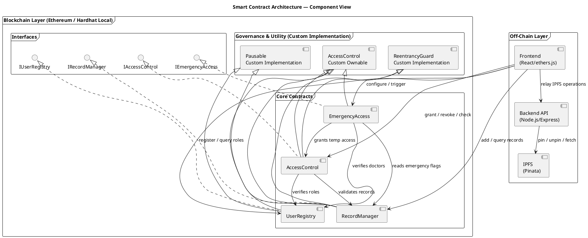
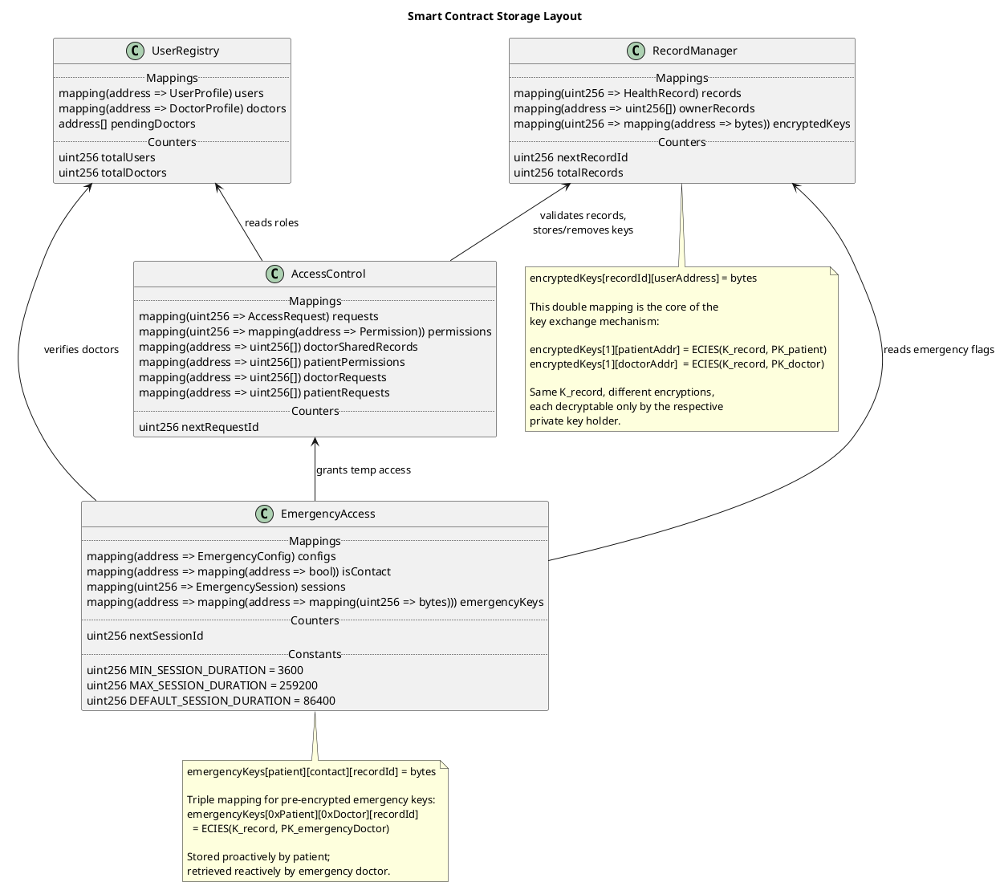
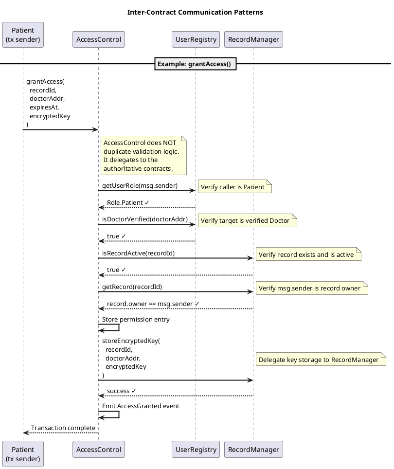
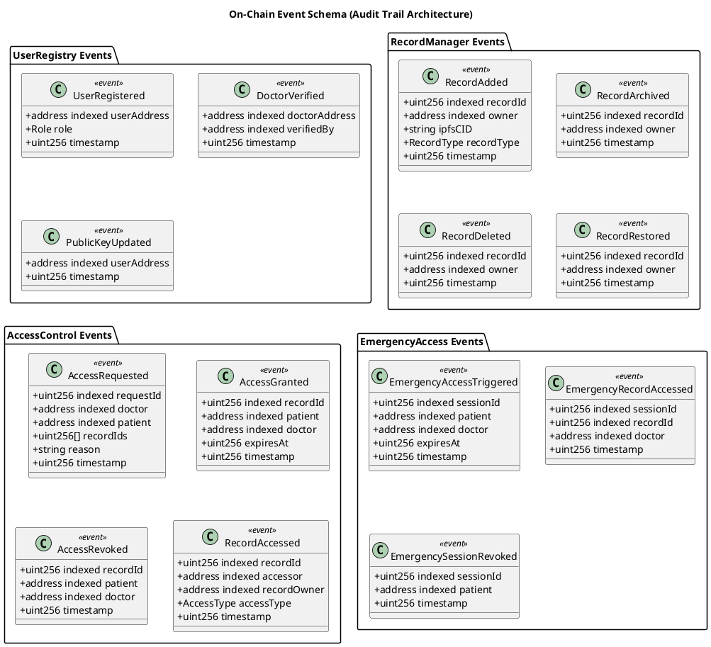
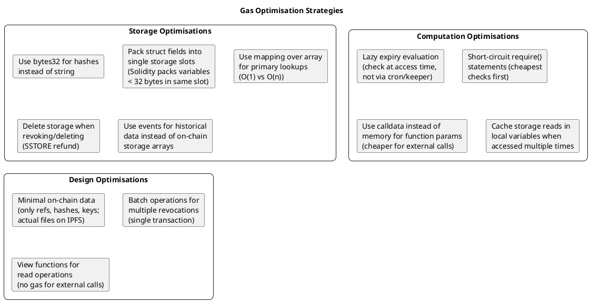

# Smart Contract Architecture & Interface Design

This section presents the complete smart contract architecture for the Personal Health Data Store, covering contract decomposition, inheritance hierarchies, storage design, function interfaces, access control patterns, event schemas, and gas optimisation considerations.

---

## 1. Contract Architecture Overview



### Architectural Rationale

**Custodian Representation & Registry:** To align with the Custodian model (e.g., the National Health System / E.S.Y.), the `UserRegistry` contract—controlled by the Custodian admin—acts as the source of truth for recognizing healthcare institutions on-chain. Additionally, an off-chain encrypted provider registry (e.g., stored on IPFS) is maintained by the Custodian to store detailed provider validation data, which is queried during emergency access scenarios.

The smart contract system follows the **Separation of Concerns** principle, dividing responsibilities across four core contracts rather than implementing a monolithic contract. This decision is motivated by three factors:

1. **Ethereum contract size limits** — Solidity contracts deployed to Ethereum mainnet (and compatible EVM chains) are subject to the EIP-170 contract size limit of 24,576 bytes. A monolithic contract containing user management, record storage, access control, and emergency logic would risk exceeding this limit as features are added.

2. **Independent upgradability** — Although full upgrade proxy patterns (e.g., UUPS or Transparent Proxy) are beyond the dissertation scope, separating contracts allows individual redeployment. For example, the `EmergencyAccess` contract could be replaced without affecting record storage.

3. **Testability** — Smaller, focused contracts are significantly easier to unit test. Each contract can be tested in isolation with mocked dependencies, following test-driven development principles.

The contracts implement custom ownership, pausable, and reentrancy protection patterns directly rather than inheriting from external libraries. This approach provides several advantages for the dissertation scope:

1. **Educational clarity** — The implementation of `onlyOwner` modifiers, `paused` state flags, and reentrancy guards is visible and explicit in the contract code, making the security patterns easier to understand and document.

2. **Reduced dependencies** — The system has no external library dependencies beyond the Solidity standard library, simplifying deployment and reducing the risk of supply chain attacks.

3. **Custom error handling** — The contracts use custom error messages (e.g., `"UserRegistry: unauthorized caller"`) rather than library-specific errors, providing clearer debugging information.

The implemented patterns follow the same security principles as established libraries: ownership is managed through an `owner` address with `onlyOwner` modifier checks, pausing uses a boolean `_paused` flag with `whenNotPaused`/`whenPaused` modifiers, and reentrancy protection tracks function entry state using a `_status` variable with `nonReentrant` modifier. These are straightforward patterns that can be correctly implemented in a limited scope without requiring external dependencies.

---

## 2. Contract Interface Definitions

### 2.1 IUserRegistry

```solidity
// SPDX-License-Identifier: MIT
pragma solidity ^0.8.19;

/**
 * @title IUserRegistry
 * @notice Interface for user registration and role management
 * @dev Manages wallet-based identity, roles, and encryption public keys
 *
 * Requirements Covered: FR-001, FR-003, FR-004, FR-005, NFR-006
 */
interface IUserRegistry {

    // ──────────────────────────────────────────────
    //  Enums
    // ──────────────────────────────────────────────

    enum Role {
        Unregistered,   // 0 - Default for unknown addresses
        Patient,        // 1 - Can upload, manage, share records
        Doctor          // 2 - Can request and view shared records
    }

    // ──────────────────────────────────────────────
    //  Structs
    // ──────────────────────────────────────────────

    struct UserProfile {
        Role role;
        bool isRegistered;
        bytes encryptionPublicKey;  // For key exchange (RSA-OAEP public key hex-encoded JWK)
        uint256 registeredAt;
    }

    struct DoctorProfile {
        string name;
        string licenseNumber;
        string specialty;
        string institution;
        uint256 registeredAt;
    }

    // ──────────────────────────────────────────────
    //  Events
    // ──────────────────────────────────────────────

    /// @notice Emitted when a new user registers
    event UserRegistered(
        address indexed userAddress,
        Role role,
        uint256 timestamp
    );

    /// @notice Emitted when a user updates their encryption public key
    event PublicKeyUpdated(
        address indexed userAddress,
        uint256 timestamp
    );

    // ──────────────────────────────────────────────
    //  Registration Functions
    // ──────────────────────────────────────────────

    /**
     * @notice Register the caller as a patient
     * @param _encryptionPublicKey The caller's RSA-OAEP public key hex-encoded JWK
     *
     * Requirements:
     * - Caller must not already be registered
     * - Encryption public key must not be empty
     *
     * Emits: UserRegistered
     */
    function registerAsPatient(
        bytes calldata _encryptionPublicKey
    ) external;

    /**
     * @notice Register the caller as a doctor
     * @param _name Full name of the doctor
     * @param _licenseNumber Professional license number
     * @param _specialty Medical specialty
     * @param _institution Affiliated institution
     * @param _encryptionPublicKey The caller's RSA-OAEP public key hex-encoded JWK
     *
     * Requirements:
     * - Caller must not already be registered
     * - All credential fields must be non-empty
     * - Encryption public key must not be empty
     *
     * Emits: UserRegistered
     */
    function registerAsDoctor(
        string calldata _name,
        string calldata _licenseNumber,
        string calldata _specialty,
        string calldata _institution,
        bytes calldata _encryptionPublicKey
    ) external;

    // ──────────────────────────────────────────────
    //  Key Management
    // ──────────────────────────────────────────────

    /**
     * @notice Update the caller's encryption public key
     * @param _newPublicKey The new RSA-OAEP public key hex-encoded JWK
     *
     * Requirements:
     * - Caller must be registered
     * - New key must not be empty
     *
     * Note: Updating the key means previously encrypted keys
     * (for existing shared records) will use the OLD key.
     * Only new key exchanges will use the updated key.
     *
     * Emits: PublicKeyUpdated
     */
    function updatePublicKey(
        bytes calldata _newPublicKey
    ) external;

    // ──────────────────────────────────────────────
    //  View Functions (no gas cost when called externally)
    // ──────────────────────────────────────────────

    /**
     * @notice Get the role of a given address
     * @param _user The address to query
     * @return The user's Role enum value
     */
    function getUserRole(address _user) external view returns (Role);

    /**
     * @notice Check if an address is a registered user
     * @param _user The address to query
     * @return True if the address is registered
     */
    function isRegistered(address _user) external view returns (bool);

    /**
     * @notice Get the encryption public key for a user
     * @param _user The address to query
     * @return The user's RSA public key bytes
     */
    function getPublicKey(
        address _user
    ) external view returns (bytes memory);

    /**
     * @notice Get the full profile for a user
     * @param _user The address to query
     * @return The UserProfile struct
     */
    function getUserProfile(
        address _user
    ) external view returns (UserProfile memory);

    /**
     * @notice Get the doctor-specific profile
     * @param _doctor The doctor's address
     * @return The DoctorProfile struct
     */
    function getDoctorProfile(
        address _doctor
    ) external view returns (DoctorProfile memory);

    /**
     * @notice Check if a doctor is verified
     * @param _doctor The doctor's address
     * @return True if the doctor's status is registered (Verified check is delegated off-chain to Custodian)
     */
    function isDoctorVerified(
        address _doctor
    ) external view returns (bool);
}
```

---

### 2.2 IRecordManager

```solidity
// SPDX-License-Identifier: MIT
pragma solidity ^0.8.19;

/**
 * @title IRecordManager
 * @notice Interface for health record lifecycle management
 * @dev Manages on-chain references to encrypted off-chain records
 *
 * Requirements Covered: FR-006, FR-007, FR-008, FR-009, FR-010, FR-015
 *
 * Architecture Note:
 * This contract stores REFERENCES (IPFS CIDs, content hashes) only.
 * Actual health data is encrypted client-side and stored on IPFS.
 * The contract never sees, stores, or processes plaintext health data.
 */
interface IRecordManager {

    // ──────────────────────────────────────────────
    //  Enums
    // ──────────────────────────────────────────────

    enum RecordType {
        LabResult,          // 0
        Prescription,       // 1
        ImagingReport,      // 2
        DischargeSummary,   // 3
        AllergyRecord,      // 4
        VaccinationRecord,  // 5
        ClinicalNote,       // 6
        Other               // 7
    }

    enum RecordStatus {
        Active,     // 0
        Archived,   // 1
        Deleted     // 2
    }

    // ──────────────────────────────────────────────
    //  Structs
    // ──────────────────────────────────────────────

    struct HealthRecord {
        uint256 recordId;
        address owner;
        string ipfsCID;             // IPFS Content Identifier
        bytes32 contentHash;        // keccak256 of encrypted content
        RecordType recordType;
        RecordStatus status;
        bool isEmergency;           // Flagged for emergency access
        uint256 createdAt;
        uint256 updatedAt;
    }

    // ──────────────────────────────────────────────
    //  Events
    // ──────────────────────────────────────────────

    /// @notice Emitted when a new record is added
    event RecordAdded(
        uint256 indexed recordId,
        address indexed owner,
        string ipfsCID,
        RecordType recordType,
        uint256 timestamp
    );

    /// @notice Emitted when a record is archived (soft delete)
    event RecordArchived(
        uint256 indexed recordId,
        address indexed owner,
        uint256 timestamp
    );

    /// @notice Emitted when a record is permanently deleted
    event RecordDeleted(
        uint256 indexed recordId,
        address indexed owner,
        uint256 timestamp
    );

    /// @notice Emitted when a record is restored from archive
    event RecordRestored(
        uint256 indexed recordId,
        address indexed owner,
        uint256 timestamp
    );

    /// @notice Emitted when emergency flag is toggled
    event EmergencyFlagUpdated(
        uint256 indexed recordId,
        address indexed owner,
        bool isEmergency,
        uint256 timestamp
    );

    // ──────────────────────────────────────────────
    //  Record Management Functions
    // ──────────────────────────────────────────────

    /**
     * @notice Add a new health record reference
     * @param _ipfsCID The IPFS Content Identifier of the encrypted file
     * @param _contentHash keccak256 hash of the encrypted content
     *        (for integrity verification — see AD-004)
     * @param _recordType The type/category of the health record
     * @param _encryptedKey The AES-256 key encrypted with the
     *        patient's public key (ECIES). See SD-007 Phase 1
     * @return recordId The unique identifier assigned to this record
     *
     * Requirements:
     * - Caller must be a registered patient
     * - IPFS CID must not be empty
     * - Content hash must not be zero
     *
     * Emits: RecordAdded
     */
    function addRecord(
        string calldata _ipfsCID,
        bytes32 _contentHash,
        RecordType _recordType,
        bytes calldata _encryptedKey
    ) external returns (uint256 recordId);

    /**
     * @notice Archive a record (soft delete, reversible)
     * @param _recordId The ID of the record to archive
     *
     * Requirements:
     * - Caller must be the record owner
     * - Record must be in Active status
     *
     * Side Effects:
     * - All active access permissions for this record are revoked
     *   (cascade revocation — see AD-008)
     *
     * Emits: RecordArchived
     */
    function archiveRecord(uint256 _recordId) external;

    /**
     * @notice Permanently delete a record reference
     * @param _recordId The ID of the record to delete
     *
     * Requirements:
     * - Caller must be the record owner
     * - Record must not already be deleted
     *
     * Side Effects:
     * - All access permissions revoked
     * - All encrypted keys for this record deleted
     * - IPFS CID cleared from storage
     *
     * Note: Off-chain IPFS unpinning must be triggered
     * separately by the backend (see AD-008 narrative)
     *
     * Emits: RecordDeleted
     */
    function deleteRecord(uint256 _recordId) external;

    /**
     * @notice Restore an archived record
     * @param _recordId The ID of the record to restore
     *
     * Requirements:
     * - Caller must be the record owner
     * - Record must be in Archived status
     *
     * Note: Previously revoked permissions are NOT reinstated.
     * Patient must re-grant access if desired (security by design)
     *
     * Emits: RecordRestored
     */
    function restoreRecord(uint256 _recordId) external;

    /**
     * @notice Toggle emergency access flag for a record
     * @param _recordId The record ID
     * @param _isEmergency Whether this record should be
     *        available during emergency access
     *
     * Requirements:
     * - Caller must be the record owner
     * - Record must be Active
     *
     * Emits: EmergencyFlagUpdated
     */
    function setEmergencyFlag(
        uint256 _recordId,
        bool _isEmergency
    ) external;

    // ──────────────────────────────────────────────
    //  Encrypted Key Storage
    // ──────────────────────────────────────────────

    /**
     * @notice Store an encrypted AES key for a specific user
     * @param _recordId The record ID
     * @param _grantee The address for whom the key is encrypted
     * @param _encryptedKey The AES key encrypted with the
     *        grantee's public key
     *
     * @dev Called internally during addRecord (for owner) and
     *      by AccessControl during grantAccess (for doctors).
     *      Only callable by the record owner or the AccessControl
     *      contract.
     */
    function storeEncryptedKey(
        uint256 _recordId,
        address _grantee,
        bytes calldata _encryptedKey
    ) external;

    /**
     * @notice Remove an encrypted key (during revocation or deletion)
     * @param _recordId The record ID
     * @param _grantee The address whose key to remove
     */
    function removeEncryptedKey(
        uint256 _recordId,
        address _grantee
    ) external;

    // ──────────────────────────────────────────────
    //  View Functions
    // ──────────────────────────────────────────────

    /**
     * @notice Get a specific record's metadata
     * @param _recordId The record ID
     * @return The HealthRecord struct
     */
    function getRecord(
        uint256 _recordId
    ) external view returns (HealthRecord memory);

    /**
     * @notice Get all record IDs owned by a specific patient
     * @param _owner The patient's address
     * @return Array of record IDs
     */
    function getRecordsByOwner(
        address _owner
    ) external view returns (uint256[] memory);

    /**
     * @notice Get the IPFS CID for a record
     * @param _recordId The record ID
     * @return The IPFS CID string
     */
    function getRecordCID(
        uint256 _recordId
    ) external view returns (string memory);

    /**
     * @notice Get the content hash for integrity verification
     * @param _recordId The record ID
     * @return The keccak256 hash of the encrypted content
     */
    function getContentHash(
        uint256 _recordId
    ) external view returns (bytes32);

    /**
     * @notice Get the encrypted AES key for a specific user
     * @param _recordId The record ID
     * @param _user The address whose encrypted key to retrieve
     * @return The encrypted key bytes
     */
    function getEncryptedKey(
        uint256 _recordId,
        address _user
    ) external view returns (bytes memory);

    /**
     * @notice Get all emergency-flagged records for a patient
     * @param _owner The patient's address
     * @return Array of record IDs flagged for emergency access
     */
    function getEmergencyRecords(
        address _owner
    ) external view returns (uint256[] memory);

    /**
     * @notice Get the total number of records in the system
     * @return The total record count
     */
    function getRecordCount() external view returns (uint256);

    /**
     * @notice Check if a record exists and is active
     * @param _recordId The record ID
     * @return True if the record exists and status is Active
     */
    function isRecordActive(
        uint256 _recordId
    ) external view returns (bool);
}
```

---

### 2.3 IAccessControl

```solidity
// SPDX-License-Identifier: MIT
pragma solidity ^0.8.19;

/**
 * @title IAccessControl
 * @notice Interface for consent-based access management
 * @dev Handles access requests, grants, revocations, and audit logging
 *
 * Requirements Covered: FR-011, FR-012, FR-013, FR-016, NFR-008, NFR-009
 *
 * Design Principle:
 * Access is ALWAYS patient-initiated (grant) or patient-terminated (revoke).
 * Doctors can REQUEST access but cannot self-grant.
 * This enforces the consent-based model required by NFR-008.
 */
interface IAccessControl {

    // ──────────────────────────────────────────────
    //  Enums
    // ──────────────────────────────────────────────

    enum RequestStatus {
        Pending,    // 0 - Awaiting patient decision
        Approved,   // 1 - Patient approved
        Rejected,   // 2 - Patient rejected
        Expired     // 3 - Request timed out
    }

    enum AccessType {
        VIEW,       // 0 - Read access only
        EMERGENCY   // 1 - Emergency access
    }

    // ──────────────────────────────────────────────
    //  Structs
    // ──────────────────────────────────────────────

    struct AccessRequest {
        uint256 requestId;
        address doctor;
        address patient;
        uint256[] recordIds;
        string reason;
        RequestStatus status;
        uint256 requestedAt;
        uint256 respondedAt;
    }

    struct Permission {
        bool isActive;
        address grantedBy;          // Patient address
        address grantedTo;          // Doctor address
        uint256 recordId;
        uint256 grantedAt;
        uint256 expiresAt;
        uint256 revokedAt;          // 0 if not revoked
    }

    struct AccessLogEntry {
        address accessor;
        uint256 recordId;
        AccessType accessType;
        uint256 timestamp;
        bytes32 transactionHash;
    }

    // ──────────────────────────────────────────────
    //  Events
    // ──────────────────────────────────────────────

    /// @notice Emitted when a doctor requests access
    event AccessRequested(
        uint256 indexed requestId,
        address indexed doctor,
        address indexed patient,
        uint256[] recordIds,
        string reason,
        uint256 timestamp
    );

    /// @notice Emitted when a patient grants access
    event AccessGranted(
        uint256 indexed recordId,
        address indexed patient,
        address indexed doctor,
        uint256 expiresAt,
        uint256 timestamp
    );

    /// @notice Emitted when a patient revokes access
    event AccessRevoked(
        uint256 indexed recordId,
        address indexed patient,
        address indexed doctor,
        uint256 timestamp
    );

    /// @notice Emitted when a patient rejects an access request
    event AccessRequestRejected(
        uint256 indexed requestId,
        address indexed patient,
        address indexed doctor,
        uint256 timestamp
    );

    /// @notice Emitted when a record is accessed (audit trail)
    event RecordAccessed(
        uint256 indexed recordId,
        address indexed accessor,
        address indexed recordOwner,
        AccessType accessType,
        uint256 timestamp
    );

    // ──────────────────────────────────────────────
    //  Access Request Functions
    // ──────────────────────────────────────────────

    /**
     * @notice Submit an access request to a patient
     * @param _patient The patient's wallet address
     * @param _recordIds Array of record IDs being requested
     * @param _reason Justification for the access request
     * @return requestId The unique identifier for this request
     *
     * Requirements:
     * - Caller must be a verified doctor
     * - Patient must be a registered patient
     * - Record IDs must exist and belong to the patient
     * - No duplicate pending request for same doctor-patient-records
     *
     * Emits: AccessRequested
     */
    function requestAccess(
        address _patient,
        uint256[] calldata _recordIds,
        string calldata _reason
    ) external returns (uint256 requestId);

    // ──────────────────────────────────────────────
    //  Access Grant / Reject Functions
    // ──────────────────────────────────────────────

    /**
     * @notice Approve an access request and grant permission
     * @param _requestId The ID of the access request
     * @param _expiresAt Timestamp when access should expire
     * @param _encryptedKeys Array of encrypted AES keys,
     *        one per requested record, each encrypted with
     *        the doctor's public key (ECIES)
     *
     * Requirements:
     * - Caller must be the patient who received the request
     * - Request must be in Pending status
     * - Expiry must be in the future
     * - Number of encrypted keys must match number of records
     *
     * Side Effects:
     * - Creates Permission entries for each record
     * - Stores encrypted keys in RecordManager
     *
     * Emits: AccessGranted (one per record)
     */
    function approveAccess(
        uint256 _requestId,
        uint256 _expiresAt,
        bytes[] calldata _encryptedKeys
    ) external;

    /**
     * @notice Directly grant access without a prior request
     * @param _recordId The record ID to share
     * @param _doctor The doctor's address
     * @param _expiresAt Expiry timestamp
     * @param _encryptedKey Encrypted AES key for the doctor
     *
     * @dev This allows patients to proactively share records
     *      without waiting for a doctor to request access.
     *      Useful for scheduled appointments or referrals.
     *
     * Requirements:
     * - Caller must be the record owner
     * - Doctor must be verified
     * - Record must be active
     *
     * Emits: AccessGranted
     */
    function grantAccess(
        uint256 _recordId,
        address _doctor,
        uint256 _expiresAt,
        bytes calldata _encryptedKey
    ) external;

    /**
     * @notice Reject an access request
     * @param _requestId The ID of the request to reject
     *
     * Requirements:
     * - Caller must be the patient who received the request
     * - Request must be in Pending status
     *
     * Emits: AccessRequestRejected
     */
    function rejectAccess(uint256 _requestId) external;

    // ──────────────────────────────────────────────
    //  Revocation Functions
    // ──────────────────────────────────────────────

    /**
     * @notice Revoke a doctor's access to a specific record
     * @param _recordId The record ID
     * @param _doctor The doctor's address
     *
     * Requirements:
     * - Caller must be the record owner
     * - An active permission must exist
     *
     * Side Effects:
     * - Permission set to inactive
     * - Encrypted key deleted from RecordManager
     *
     * Emits: AccessRevoked
     */
    function revokeAccess(
        uint256 _recordId,
        address _doctor
    ) external;

    /**
     * @notice Revoke all active permissions for a record
     * @param _recordId The record ID
     *
     * @dev Used during record archival/deletion (cascade)
     *
     * Requirements:
     * - Caller must be the record owner
     *
     * Emits: AccessRevoked (one per revoked permission)
     */
    function revokeAllAccess(uint256 _recordId) external;

    /**
     * @notice Batch revoke multiple permissions
     * @param _recordIds Array of record IDs
     * @param _doctors Array of doctor addresses (parallel arrays)
     *
     * Requirements:
     * - Arrays must be same length
     * - Caller must own all specified records
     *
     * Emits: AccessRevoked (one per revocation)
     */
    function batchRevoke(
        uint256[] calldata _recordIds,
        address[] calldata _doctors
    ) external;

    // ──────────────────────────────────────────────
    //  Access Verification Functions
    // ──────────────────────────────────────────────

    /**
     * @notice Check if a doctor currently has access to a record
     * @param _doctor The doctor's address
     * @param _recordId The record ID
     * @return hasAccess True if access is currently valid
     * @return encryptedKey The encrypted AES key (if access valid)
     *
     * @dev This performs the three-stage check:
     *      1. Permission exists
     *      2. Permission is active (not revoked)
     *      3. Current time <= expiresAt (not expired)
     *      This is the "lazy expiry" mechanism described in AD-006
     */
    function checkAccess(
        address _doctor,
        uint256 _recordId
    ) external view returns (
        bool hasAccess,
        bytes memory encryptedKey
    );

    // ──────────────────────────────────────────────
    //  Audit Trail Functions
    // ──────────────────────────────────────────────

    /**
     * @notice Log a record access event (called when viewing)
     * @param _recordId The record ID being accessed
     * @param _accessType The type of access (VIEW or EMERGENCY)
     *
     * Requirements:
     * - Caller must have active access to the record
     *   (either as owner or via granted permission)
     *
     * Emits: RecordAccessed
     */
    function logAccess(
        uint256 _recordId,
        AccessType _accessType
    ) external;

    // ──────────────────────────────────────────────
    //  View Functions
    // ──────────────────────────────────────────────

    /**
     * @notice Get all records shared with a specific doctor
     * @param _doctor The doctor's address
     * @return Array of record IDs with active permissions
     */
    function getSharedRecords(
        address _doctor
    ) external view returns (uint256[] memory);

    /**
     * @notice Get all active permissions for a record
     * @param _recordId The record ID
     * @return Array of Permission structs
     */
    function getPermissionsForRecord(
        uint256 _recordId
    ) external view returns (Permission[] memory);

    /**
     * @notice Get all permissions granted by a patient
     * @param _patient The patient's address
     * @return Array of Permission structs
     */
    function getPermissionsByOwner(
        address _patient
    ) external view returns (Permission[] memory);

    /**
     * @notice Get pending access requests for a patient
     * @param _patient The patient's address
     * @return Array of AccessRequest structs
     */
    function getPendingRequests(
        address _patient
    ) external view returns (AccessRequest[] memory);

    /**
     * @notice Get access requests submitted by a doctor
     * @param _doctor The doctor's address
     * @return Array of AccessRequest structs
     */
    function getRequestsByDoctor(
        address _doctor
    ) external view returns (AccessRequest[] memory);

    /**
     * @notice Get the total number of access requests
     * @return The total request count
     */
    function getRequestCount() external view returns (uint256);
}
```

---

### 2.4 IEmergencyAccess

```solidity
// SPDX-License-Identifier: MIT
pragma solidity ^0.8.19;

/**
 * @title IEmergencyAccess
 * @notice Interface for emergency access mechanism via Custodian
 * @dev Allows verified healthcare institutions to request and receive
 *      OTP-based access to critical health records when the patient 
 *      is incapacitated.
 *
 * Requirements Covered: FR-014, FR-014c, FR-014d
 *
 * Design Decision:
 * This implements an OTP (one-time password) style mechanism.
 * The Custodian (e.g., backend oracle) verifies the requester against 
 * the provider registry, generates a random OTP, encrypts it with 
 * the institution's public key, and issues it. The contract records 
 * the OTP exchange securely.
 *
 * Security Model:
 * - Only wallets present in the Custodian provider registry can trigger this
 * - All actions are permanently logged on-chain (`EmergencyAccessTriggered`)
 * - OTPs are valid for a single access session
 * - Only emergency-flagged records are accessible
 * - Patient is notified upon next login
 */
interface IEmergencyAccess {

    // ──────────────────────────────────────────────
    //  Enums
    // ──────────────────────────────────────────────

    enum SessionStatus {
        Active,     // 0 - Session is live
        Expired,    // 1 - Session timed out
        Revoked     // 2 - Patient manually ended session
    }

    // ──────────────────────────────────────────────
    //  Structs
    // ──────────────────────────────────────────────

    struct EmergencySession {
        uint256 sessionId;
        address patient;
        address doctor;
        SessionStatus status;
        uint256 startedAt;
        uint256 expiresAt;
        uint256 recordsAccessed;    // Counter for audit
    }

    struct EmergencyConfig {
        address patient;
        address[] trustedContacts;
        uint256 sessionDuration;    // Default: 86400 (24 hours)
        bool isConfigured;
    }

    // ──────────────────────────────────────────────
    //  Events
    // ──────────────────────────────────────────────

    /// @notice Emitted when a patient configures emergency access
    event EmergencyConfigured(
        address indexed patient,
        address[] trustedContacts,
        uint256 sessionDuration,
        uint256 timestamp
    );

    /// @notice Emitted when emergency contacts are updated
    event EmergencyContactsUpdated(
        address indexed patient,
        address[] newContacts,
        uint256 timestamp
    );

    /// @notice Emitted when emergency access is triggered
    event EmergencyAccessTriggered(
        uint256 indexed sessionId,
        address indexed patient,
        address indexed doctor,
        uint256 expiresAt,
        uint256 timestamp
    );

    /// @notice Emitted when emergency record is accessed
    event EmergencyRecordAccessed(
        uint256 indexed sessionId,
        uint256 indexed recordId,
        address indexed doctor,
        uint256 timestamp
    );

    /// @notice Emitted when a patient revokes an emergency session
    event EmergencySessionRevoked(
        uint256 indexed sessionId,
        address indexed patient,
        uint256 timestamp
    );

    /// @notice Emitted when pre-encrypted emergency keys are stored
    event EmergencyKeysStored(
        address indexed patient,
        uint256 recordCount,
        uint256 contactCount,
        uint256 timestamp
    );

    // ──────────────────────────────────────────────
    //  Emergency Trigger and OTP Issuance
    // ──────────────────────────────────────────────

    /**
     * @notice Trigger emergency access for an incapacitated patient
     * @param _patient The incapacitated patient's address
     * @return sessionId The unique emergency session identifier
     *
     * Requirements:
     * - Caller must be a verified doctor/institution
     * - Patient must have records flagged for emergency access
     * - Emits an event that the Custodian oracle listens to for OTP generation
     *
     * Emits: EmergencyAccessTriggered
     */
    function triggerEmergencyAccess(
        address _patient
    ) external returns (uint256 sessionId);

    /**
     * @notice Custodian issues the encrypted OTP for an emergency session
     * @param _sessionId The emergency session ID
     * @param _encryptedOTP The OTP encrypted with the institution's public key
     *
     * Requirements:
     * - Caller must be the Custodian admin / oracle
     * - Session must be in triggered state
     *
     * Emits: EmergencyRecordAccessed (or equivalent OTP event)
     */
    function issueEmergencyOTP(
        uint256 _sessionId,
        bytes calldata _encryptedOTP
    ) external;

    /**
     * @notice Retrieve the emergency OTP and requested record IDs
     * @param _patient The patient's address
     * @param _sessionId The emergency session ID
     * @return recordIds Array of emergency record IDs
     * @return encryptedOTP The OTP to decrypt the records once
     *
     * Requirements:
     * - Caller must be the session's doctor
     * - Session must have an issued OTP
     *
     * Side Effects:
     * - Marks OTP as consumed to ensure single-use
     */
    function getEmergencyRecordsOTP(
        address _patient,
        uint256 _sessionId
    ) external returns (
        uint256[] memory recordIds,
        bytes memory encryptedOTP
    );

    // ──────────────────────────────────────────────
    //  Session Management
    // ──────────────────────────────────────────────

    /**
     * @notice Patient revokes an active emergency session
     * @param _sessionId The session to revoke
     *
     * @dev Used when patient regains consciousness/access
     *      and wants to immediately end emergency access
     *
     * Requirements:
     * - Caller must be the session's patient
     * - Session must be Active
     *
     * Emits: EmergencySessionRevoked
     */
    function revokeEmergencySession(
        uint256 _sessionId
    ) external;

    // ──────────────────────────────────────────────
    //  View Functions
    // ──────────────────────────────────────────────

    /**
     * @notice Check if an address is an emergency contact
     * @param _doctor The doctor's address
     * @param _patient The patient's address
     * @return True if the doctor is in the patient's contacts
     */
    function isEmergencyContact(
        address _doctor,
        address _patient
    ) external view returns (bool);

    /**
     * @notice Get emergency configuration for a patient
     * @param _patient The patient's address
     * @return The EmergencyConfig struct
     */
    function getEmergencyConfig(
        address _patient
    ) external view returns (EmergencyConfig memory);

    /**
     * @notice Get details of an emergency session
     * @param _sessionId The session ID
     * @return The EmergencySession struct
     */
    function getSession(
        uint256 _sessionId
    ) external view returns (EmergencySession memory);

    /**
     * @notice Get all emergency sessions for a patient
     * @param _patient The patient's address
     * @return Array of EmergencySession structs
     */
    function getSessionsByPatient(
        address _patient
    ) external view returns (EmergencySession[] memory);

    /**
     * @notice Check if there is an active emergency session
     * @param _patient The patient's address
     * @param _doctor The doctor's address
     * @return True if an active, non-expired session exists
     */
    function hasActiveSession(
        address _patient,
        address _doctor
    ) external view returns (bool);
}
```

---

## 3. Storage Design & Data Model



### Storage Design Rationale

The storage layout is designed around Solidity's mapping-based storage model, which provides O(1) lookups by key but does not support iteration. Where iteration is needed (e.g., listing all records for a patient, all permissions for a record), supplementary arrays are maintained alongside the mappings.

**The `encryptedKeys` double mapping** in `RecordManager` is the architectural cornerstone of the entire key exchange mechanism. For each record, it stores one encrypted version of the AES key per authorised user. The key stored at `encryptedKeys[recordId][patientAddress]` is encrypted with the patient's public key (stored during upload), while the key at `encryptedKeys[recordId][doctorAddress]` is encrypted with the doctor's public key (stored during access grant). Both entries decrypt to the same underlying AES key, but each can only be decrypted by the respective private key holder. This is the practical implementation of the ECIES-based key exchange described in SD-007.

**The `emergencyKeys` triple mapping** in `EmergencyAccess` follows the same principle but adds a dimension for the emergency contact. These keys are pre-encrypted by the patient during emergency configuration and remain dormant on-chain until an emergency session is triggered. The triple mapping structure `[patient][contact][recordId]` ensures that different emergency contacts receive independently encrypted copies, maintaining the principle that each party can only access records through their own private key.

**Gas considerations** influenced several design decisions:
- String fields (IPFS CIDs, doctor names) are stored on-chain despite their gas cost because they are referenced frequently and their on-chain availability eliminates the need for a trusted off-chain database for critical metadata.
- Dynamic arrays for record and permission lists are acknowledged as potentially expensive to iterate at scale. For a dissertation prototype, this is acceptable; production systems would implement pagination or off-chain indexing (e.g., The Graph).

---

## 4. Inter-Contract Communication



### Inter-Contract Communication Pattern

The contracts communicate through direct function calls using stored contract addresses. During deployment, each contract is configured with the addresses of its dependencies:

```solidity
// Example: AccessControl constructor with custom ownership
constructor(
    address _userRegistryAddress,
    address _recordManagerAddress
) {
    owner = msg.sender;  // Custom ownership assignment
    userRegistry = IUserRegistry(_userRegistryAddress);
    recordManager = IRecordManager(_recordManagerAddress);
}

// Custom ownership modifier (implemented in each contract)
modifier onlyOwner() {
    require(msg.sender == owner, "AccessControl: caller is not the owner");
    _;
}
```

This pattern means that each contract holds an interface reference to its dependencies, enabling:
1. **Type safety** — The compiler verifies that called functions match the interface definition.
2. **Loose coupling** — Contracts depend on interfaces, not implementations. A replacement `UserRegistry` that implements `IUserRegistry` can be substituted without modifying `AccessControl`.
3. **Clear dependency direction** — `AccessControl` depends on `UserRegistry` and `RecordManager`, but neither depends on `AccessControl`. This prevents circular dependencies.

The `grantAccess` example illustrates the delegation pattern: `AccessControl` does not duplicate role verification or record validation logic. Instead, it queries the authoritative contract for each piece of information, ensuring a single source of truth. This follows the DRY (Don't Repeat Yourself) principle and ensures that if role verification logic changes in `UserRegistry`, the change automatically propagates to all consumers.

---

## 5. Access Control Modifier Patterns

```solidity
// SPDX-License-Identifier: MIT
pragma solidity ^0.8.19;

/**
 * @title Common Modifiers Used Across Contracts
 * @dev These modifiers enforce access control at the function level,
 *      following the "checks-effects-interactions" pattern
 */

// ──────────────────────────────────────────────
//  UserRegistry Modifiers
// ──────────────────────────────────────────────

/// @dev Ensures the caller is not already registered
modifier onlyUnregistered() {
    require(
        !users[msg.sender].isRegistered,
        "UserRegistry: already registered"
    );
    _;
}

/// @dev Ensures the caller is a registered user
modifier onlyRegistered() {
    require(
        users[msg.sender].isRegistered,
        "UserRegistry: not registered"
    );
    _;
}

// ──────────────────────────────────────────────
//  RecordManager Modifiers
// ──────────────────────────────────────────────

/// @dev Ensures the caller is a registered patient
modifier onlyPatient() {
    require(
        userRegistry.getUserRole(msg.sender)
            == IUserRegistry.Role.Patient,
        "RecordManager: caller is not a patient"
    );
    _;
}

/// @dev Ensures the caller is the owner of the specified record
modifier onlyRecordOwner(uint256 _recordId) {
    require(
        records[_recordId].owner == msg.sender,
        "RecordManager: caller is not record owner"
    );
    _;
}

/// @dev Ensures the record exists and is active
modifier recordIsActive(uint256 _recordId) {
    require(
        records[_recordId].status == RecordStatus.Active,
        "RecordManager: record is not active"
    );
    _;
}

/// @dev Ensures the record exists (any status)
modifier recordExists(uint256 _recordId) {
    require(
        _recordId > 0 && _recordId < nextRecordId,
        "RecordManager: record does not exist"
    );
    _;
}

// ──────────────────────────────────────────────
//  AccessControl Modifiers
// ──────────────────────────────────────────────

/// @dev Ensures the caller is a verified doctor
modifier onlyVerifiedDoctor() {
    require(
        userRegistry.isDoctorVerified(msg.sender),
        "AccessControl: caller is not a verified doctor"
    );
    _;
}

/// @dev Ensures the caller is the patient for a given request
modifier onlyRequestPatient(uint256 _requestId) {
    require(
        requests[_requestId].patient == msg.sender,
        "AccessControl: caller is not the request patient"
    );
    _;
}

// ──────────────────────────────────────────────
//  EmergencyAccess Modifiers
// ──────────────────────────────────────────────

/// @dev Ensures the caller is an emergency contact of the patient
modifier onlyEmergencyContact(address _patient) {
    require(
        isContact[_patient][msg.sender],
        "EmergencyAccess: not an emergency contact"
    );
    _;
}

/// @dev Ensures the emergency session is active and not expired
modifier sessionActive(uint256 _sessionId) {
    EmergencySession storage session = sessions[_sessionId];
    require(
        session.status == SessionStatus.Active,
        "EmergencyAccess: session not active"
    );
    require(
        block.timestamp <= session.expiresAt,
        "EmergencyAccess: session expired"
    );
    _;
}
```

### Modifier Design Philosophy

The modifiers follow the **Checks-Effects-Interactions** pattern, a well-established Solidity security best practice. All precondition checks (`require` statements) execute before any state modifications or external calls. This prevents state corruption in the event of a failed check.

Each modifier has a single, clear responsibility and a descriptive revert message that aids debugging during development and provides meaningful feedback to the frontend. The revert messages are prefixed with the contract name (e.g., `"RecordManager: caller is not record owner"`) to quickly identify the source of a failure when multiple contracts are involved in a transaction.

The modifiers are composable — a function can stack multiple modifiers to enforce compound requirements:

```solidity
function archiveRecord(uint256 _recordId)
    external
    onlyRecordOwner(_recordId)
    recordIsActive(_recordId)
    nonReentrant        // custom implementation
    whenNotPaused       // custom implementation
{
    // Implementation
}
```

This declarative approach makes the access control policy for each function immediately visible in its signature, serving as both enforcement and documentation.

---

## 6. Event Schema for Audit Trail



### Event Design Principles

The event schema follows three design principles:

1. **Indexed fields for efficient querying** — Solidity allows up to three `indexed` parameters per event, which are stored as topic hashes and can be efficiently filtered by Ethereum clients. The most commonly queried fields — user addresses and record/session IDs — are consistently indexed across all events. This enables the frontend to efficiently retrieve all events relevant to a specific user or record without scanning the entire event log.

2. **Sufficient context for standalone interpretation** — Each event contains enough information to be meaningful without requiring a separate contract state query. For example, `AccessGranted` includes both the patient and doctor addresses, the record ID, and the expiry time. An auditor reviewing the event log can reconstruct the complete access history without needing to query the contract's current state, which may have changed since the event was emitted.

3. **Consistent timestamp inclusion** — Every event includes a `timestamp` field set to `block.timestamp` at the time of emission. While block timestamps can be queried from the block itself, including them in the event data simplifies off-chain processing and display. This is especially important for the audit trail feature (AD-007), where events from multiple contracts are aggregated and sorted chronologically.

The complete set of events across all four contracts forms the **immutable audit trail** required by NFR-009. Since events are stored in transaction receipts within the blockchain, they cannot be modified or deleted by any party — including the contract owner. This provides a stronger integrity guarantee than traditional database-backed audit logs.

---

## 7. Gas Optimisation Considerations



### Gas Optimisation Discussion

Gas efficiency is a practical concern even for a dissertation prototype, as excessive gas costs would make the system impractical to demonstrate. The following strategies are applied:

**Storage Optimisations:**
- Content hashes use `bytes32` (a single storage slot) rather than `string`, saving significant gas on storage operations.
- Struct fields are ordered to maximise storage slot packing. For example, `bool isEmergency`, `RecordStatus status`, and `RecordType recordType` can share a single 32-byte storage slot because their combined size is well under 32 bytes.
- The `delete` keyword is used when revoking access or deleting records, which triggers an SSTORE gas refund (currently 4,800 gas per cleared slot on post-London EVM), partially offsetting the transaction cost.
- Historical data (who accessed what record and when) is stored exclusively in events rather than in on-chain arrays. Events are approximately 8x cheaper than equivalent storage operations and are sufficient for audit purposes since they can be queried via `eth_getLogs`.

**Computation Optimisations:**
- The lazy expiry mechanism (checking `block.timestamp <= expiresAt` at access time rather than running a scheduled revocation) eliminates the need for a keeper or oracle service, saving both gas and architectural complexity.
- `require` statements are ordered with the cheapest checks first. For example, checking `msg.sender == record.owner` (a simple address comparison) is placed before `userRegistry.isDoctorVerified(doctor)` (an external call) so that obviously invalid transactions fail quickly and cheaply.
- Function parameters use `calldata` instead of `memory` for external function calls, as `calldata` avoids the memory copy that `memory` parameters incur.

**Design-Level Optimisations:**
- The fundamental design decision to store encrypted health records on IPFS rather than on-chain is itself the most significant gas optimisation. Storing a 1MB file on Ethereum would cost approximately 32 billion gas (approximately $640,000 at 20 gwei and $2,000/ETH), making on-chain storage categorically infeasible for health records.

---

## 8. Deployment Architecture

```plantuml
@startuml Deployment_Architecture
title Smart Contract Deployment Order & Configuration

|Deployer (Admin)|
|Blockchain|

|Deployer (Admin)|
start

:Deploy UserRegistry;

|Blockchain|
:UserRegistry deployed\nat address 0xUR;

|Deployer (Admin)|
:Deploy RecordManager\nwith constructor(\n  userRegistryAddress: 0xUR\n);

|Blockchain|
:RecordManager deployed\nat address 0xRM;

|Deployer (Admin)|
:Deploy AccessControl\nwith constructor(\n  userRegistryAddress: 0xUR,\n  recordManagerAddress: 0xRM\n);

|Blockchain|
:AccessControl deployed\nat address 0xAC;

|Deployer (Admin)|
:Deploy EmergencyAccess\nwith constructor(\n  userRegistryAddress: 0xUR,\n  recordManagerAddress: 0xRM,\n  accessControlAddress: 0xAC\n);

|Blockchain|
:EmergencyAccess deployed\nat address 0xEA;

== Post-Deployment Configuration ==

|Deployer (Admin)|
:Configure RecordManager:\nsetAuthorisedCaller(\n  accessControlAddress: 0xAC\n);

note right
    RecordManager.storeEncryptedKey()
    and removeEncryptedKey() must
    only be callable by the record
    owner OR the AccessControl contract.
    This prevents unauthorised key
    injection.
end note

:Configure RecordManager:\nsetEmergencyContract(\n  emergencyAccessAddress: 0xEA\n);

:Store deployed addresses\nin frontend .env config:\n\nREACT_APP_USER_REGISTRY=0xUR\nREACT_APP_RECORD_MANAGER=0xRM\nREACT_APP_ACCESS_CONTROL=0xAC\nREACT_APP_EMERGENCY_ACCESS=0xEA;

:Verify all contracts\non block explorer\n(if public testnet);

== Administrative Setup ==

:Admin registers as\nthe system administrator;

note right
    The deployer address is
    automatically set as the
    contract owner via custom
    ownership implementation.
    
    The owner can:
    - Verify/reject doctors
    - Pause contracts (emergency)
    - Update authorised callers
    
    The owner CANNOT:
    - Access patient records
    - Modify access permissions
    - Read encrypted keys
    
    This separation ensures
    admin ≠ data access.
end note

stop

@enduml
```

### Deployment Architecture Discussion

The deployment follows a strict dependency order: `UserRegistry` first (no dependencies), then `RecordManager` (depends on `UserRegistry`), then `AccessControl` (depends on both), and finally `EmergencyAccess` (depends on all three). Each contract receives its dependencies' addresses as constructor parameters, which are stored as immutable state variables.

The post-deployment configuration step is security-critical. `RecordManager`'s key storage functions (`storeEncryptedKey`, `removeEncryptedKey`) must be callable by both record owners and the `AccessControl` contract, but not by arbitrary addresses. Without this configuration, a malicious user could inject encrypted keys for records they don't own, potentially enabling unauthorised access. The `setAuthorisedCaller` function restricts these sensitive operations to the configured `AccessControl` address.

An important security property of the overall architecture, highlighted in the deployment notes, is the **separation between administrative privileges and data access**. The contract owner can pause the system, but cannot decrypt any health records, modify access permissions, or read encrypted keys. The encryption keys are encrypted with user-specific public keys and can only be decrypted by the corresponding private keys, which are held exclusively in users' MetaMask wallets. This means that even a compromised admin account cannot access patient health data — a critical security property for a health data system.

For the dissertation, deployment is to a local Hardhat network during development and testing, with optional deployment to the Sepolia testnet for demonstration purposes. The deployment script is implemented using Hardhat's deployment framework, ensuring reproducibility.

---

## 9. Security Considerations Summary

| Threat | Mitigation | Contract(s) |
|---|---|---|
| Reentrancy attacks | `ReentrancyGuard` on all state-changing functions | RM, AC |
| Unauthorised access | Role-based modifiers + ownership checks | All |
| Key injection | `setAuthorisedCaller` restricts key storage | RM |
| Denial of service (pausing) | `Pausable` with admin-only `pause`/`unpause` | UR, RM |
| Integer overflow/underflow | Solidity 0.8.x built-in overflow checks | All |
| Front-running access revocation | Revocation takes effect at block inclusion time; acknowledged limitation | AC |
| Emergency access abuse | Pre-designated contacts only, session limits, permanent logging | EA |
| Data exposure on-chain | Only encrypted keys and IPFS CIDs on-chain; no plaintext health data | RM |
| Admin privilege escalation | Admin can pause the contracts, but cannot access encrypted data | All |

---

This completes the smart contract architecture and interface design. Shall I proceed with the **class diagram / component diagram** (Section 5.1), the **frontend interface design**, or begin the **Solidity implementation** of one of these contracts?