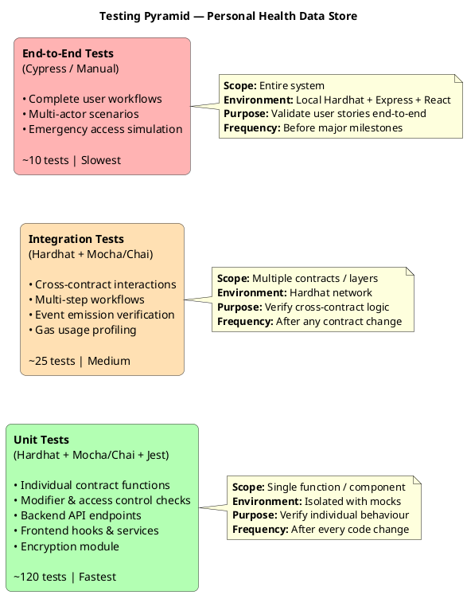

# Testing Strategy & Test Case Design

This section presents the comprehensive testing strategy for the Personal Health Data Store system, covering the testing philosophy, test architecture, unit tests for all four smart contracts, integration tests for cross-contract interactions, backend API tests, frontend component tests, end-to-end workflow tests, security-specific tests, and the test traceability matrix.

---

## 1. Testing Philosophy & Approach



### Testing Strategy Narrative

The testing strategy follows the **Testing Pyramid** model, where the majority of tests are fast, isolated unit tests at the base, supplemented by integration tests that verify cross-component behaviour, and capped with a smaller number of end-to-end tests that validate complete user workflows.

For smart contracts, testing is particularly critical because deployed contracts are **immutable** — bugs cannot be patched after deployment (without proxy patterns, which are beyond this dissertation's scope). The testing framework uses **Hardhat** as the development environment, which provides a local Ethereum network with instant block mining, deterministic test accounts with known private keys, snapshot and revert capabilities for test isolation, built-in gas reporting, and Solidity stack traces for debugging.

The testing approach applies three principles:
1. **Test the happy path and every revert path** — For each function, test both successful execution and every `require` statement that could cause a revert.
2. **Test state transitions, not just return values** — Verify that storage variables are correctly updated, events are correctly emitted, and side effects (like cascade revocations) are correctly triggered.
3. **Test with realistic scenarios** — Use test data and interaction patterns that reflect genuine usage rather than contrived edge cases.

---

## 2. Test Environment Architecture

```plantuml
@startuml Test_Environment
title Test Environment Architecture

skinparam packageStyle frame

package "Test Runner (Hardhat + Mocha)" {

    package "Test Fixtures" {
        [deployContracts()\nfixture] as DEPLOY
        [registerUsers()\nfixture] as USERS
        [uploadRecords()\nfixture] as RECORDS
        [grantAccess()\nfixture] as ACCESS
        [configureEmergency()\nfixture] as EMERG

        DEPLOY --> USERS : extends
        USERS --> RECORDS : extends
        RECORDS --> ACCESS : extends
        USERS --> EMERG : extends
    }

    package "Test Helpers" {
        [expectRevert()\nhelper] as REV
        [expectEvent()\nhelper] as EVT
        [timeTravel()\nhelper] as TIME
        [generateEncryptedKey()\nhelper] as KEY
        [createMockIPFSCID()\nhelper] as CID
        [getGasUsed()\nhelper] as GAS
    }

    package "Test Suites" {
        [UserRegistry\nTests] as UR_T
        [RecordManager\nTests] as RM_T
        [AccessControl\nTests] as AC_T
        [EmergencyAccess\nTests] as EA_T
        [Integration\nTests] as INT_T
        [Security\nTests] as SEC_T
    }
}

package "Hardhat Network" {
    database "EVM State\n(snapshot/revert)" as STATE
    [Test Accounts\n(20 accounts with\n10000 ETH each)] as ACCT
}

package "Backend Tests (Jest)" {
    [AuthService\nTests] as AUTH_T
    [IPFSService\nTests] as IPFS_T
    [Middleware\nTests] as MW_T
    [API Route\nTests (supertest)] as API_T
}

package "Frontend Tests (Jest + React Testing Library)" {
    [Hook Tests] as HOOK_T
    [Component Tests] as COMP_T
    [Encryption\nModule Tests] as ENC_T
    [Service Tests] as SVC_T
}

UR_T --> DEPLOY : uses fixture
RM_T --> USERS : uses fixture
AC_T --> RECORDS : uses fixture
EA_T --> EMERG : uses fixture
INT_T --> ACCESS : uses fixture

UR_T --> REV : uses helper
UR_T --> EVT : uses helper
AC_T --> TIME : uses helper
RM_T --> CID : uses helper
AC_T --> KEY : uses helper
INT_T --> GAS : uses helper

Test Suites --> STATE : read/write
Test Suites --> ACCT : uses accounts

@enduml
```

### Test Fixtures Design

```javascript
// test/helpers/fixtures.js

const { ethers } = require("hardhat");

/**
 * Base fixture: Deploy all contracts with proper linking
 * Uses Hardhat's loadFixture for snapshot/revert efficiency
 */
async function deployContractsFixture() {
    const [owner, patient1, patient2, doctor1, doctor2,
           doctor3, emergencyDoctor, unauthorised, ...others] 
        = await ethers.getSigners();

    // Deploy UserRegistry
    const UserRegistry = await ethers.getContractFactory("UserRegistry");
    const userRegistry = await UserRegistry.deploy();
    await userRegistry.waitForDeployment();

    // Deploy RecordManager with UserRegistry address
    const RecordManager = await ethers.getContractFactory("RecordManager");
    const recordManager = await RecordManager.deploy(
        await userRegistry.getAddress()
    );
    await recordManager.waitForDeployment();

    // Deploy AccessControl with UserRegistry and RecordManager
    const AccessControl = await ethers.getContractFactory("AccessControl");
    const accessControl = await AccessControl.deploy(
        await userRegistry.getAddress(),
        await recordManager.getAddress()
    );
    await accessControl.waitForDeployment();

    // Deploy EmergencyAccess with all three
    const EmergencyAccess = await ethers.getContractFactory("EmergencyAccess");
    const emergencyAccess = await EmergencyAccess.deploy(
        await userRegistry.getAddress(),
        await recordManager.getAddress(),
        await accessControl.getAddress()
    );
    await emergencyAccess.waitForDeployment();

    // Post-deployment configuration
    await recordManager.setAuthorisedCaller(
        await accessControl.getAddress()
    );
    await recordManager.setEmergencyContract(
        await emergencyAccess.getAddress()
    );

    return {
        userRegistry, recordManager, accessControl, emergencyAccess,
        owner, patient1, patient2, doctor1, doctor2, 
        doctor3, emergencyDoctor, unauthorised, others
    };
}

/**
 * Extended fixture: Deploy + register users
 */
async function registerUsersFixture() {
    const contracts = await deployContractsFixture();
    const { userRegistry, owner, patient1, patient2, 
            doctor1, doctor2, emergencyDoctor } = contracts;

    // Generate mock encryption public keys
    const mockPublicKey = ethers.toUtf8Bytes(
        "0x04" + "a".repeat(128) // Mock ECIES public key
    );

    // Register patients
    await userRegistry.connect(patient1)
        .registerAsPatient(mockPublicKey);
    await userRegistry.connect(patient2)
        .registerAsPatient(mockPublicKey);

    // Register doctors
    await userRegistry.connect(doctor1)
        .registerAsDoctor(
            "Dr. Alice Smith",
            "MED-001",
            "Cardiology",
            "City Hospital",
            mockPublicKey
        );

    await userRegistry.connect(doctor2)
        .registerAsDoctor(
            "Dr. Bob Jones",
            "MED-002",
            "Neurology",
            "General Hospital",
            mockPublicKey
        );

    await userRegistry.connect(emergencyDoctor)
        .registerAsDoctor(
            "Dr. Emergency",
            "MED-003",
            "Emergency Medicine",
            "ER Department",
            mockPublicKey
        );

    return { ...contracts, mockPublicKey };
}

/**
 * Extended fixture: Deploy + users + sample records
 */
async function uploadRecordsFixture() {
    const base = await registerUsersFixture();
    const { recordManager, patient1, patient2, mockPublicKey } = base;

    const mockCID = "QmTest1234567890abcdef";
    const mockHash = ethers.keccak256(ethers.toUtf8Bytes("encrypted-content"));
    const mockEncryptedKey = ethers.toUtf8Bytes("mock-encrypted-aes-key");

    // Patient 1 uploads 3 records
    await recordManager.connect(patient1).addRecord(
        mockCID + "1", mockHash, 0, mockEncryptedKey // LabResult
    );
    await recordManager.connect(patient1).addRecord(
        mockCID + "2", mockHash, 4, mockEncryptedKey // AllergyRecord
    );
    await recordManager.connect(patient1).addRecord(
        mockCID + "3", mockHash, 1, mockEncryptedKey // Prescription
    );

    // Patient 2 uploads 1 record
    await recordManager.connect(patient2).addRecord(
        mockCID + "4", mockHash, 0, mockEncryptedKey // LabResult
    );

    return {
        ...base,
        mockCID, mockHash, mockEncryptedKey,
        patient1RecordIds: [1, 2, 3],
        patient2RecordIds: [4]
    };
}

/**
 * Extended fixture: Deploy + users + records + access granted
 */
async function grantAccessFixture() {
    const base = await uploadRecordsFixture();
    const { accessControl, patient1, doctor1, mockEncryptedKey } = base;

    const futureTimestamp = Math.floor(Date.now() / 1000) + 86400; // +24hrs

    // Patient1 grants Doctor1 access to record 1
    await accessControl.connect(patient1).grantAccess(
        1,                      // recordId
        doctor1.address,        // doctor
        futureTimestamp,        // expiresAt
        mockEncryptedKey        // encrypted AES key for doctor
    );

    return { ...base, futureTimestamp };
}

/**
 * Extended fixture: Deploy + users + records + emergency flag set
 */
async function configureEmergencyFixture() {
    const base = await uploadRecordsFixture();
    const { recordManager, emergencyAccess, patient1, 
            emergencyDoctor, mockEncryptedKey } = base;

    // Flag records 1 and 2 as emergency records
    await recordManager.connect(patient1).setEmergencyFlag(1, true);
    await recordManager.connect(patient1).setEmergencyFlag(2, true);

    // In OTP model, contacts and keys are not pre-configured.
    
    return { ...base, mockEncryptedOTP: ethers.toUtf8Bytes("mock-otp-123") };
}

module.exports = {
    deployContractsFixture,
    registerUsersFixture,
    uploadRecordsFixture,
    grantAccessFixture,
    configureEmergencyFixture
};
```

### Test Helpers

```javascript
// test/helpers/testHelpers.js

const { ethers } = require("hardhat");
const { expect } = require("chai");
const { time } = require("@nomicfoundation/hardhat-network-helpers");

/**
 * Advance blockchain time by specified seconds
 * Uses Hardhat's time helpers for deterministic time control
 */
async function timeTravel(seconds) {
    await time.increase(seconds);
}

/**
 * Advance to a specific timestamp
 */
async function travelToTimestamp(timestamp) {
    await time.increaseTo(timestamp);
}

/**
 * Generate a mock IPFS CID for testing
 */
function generateMockCID(index = 0) {
    return `QmTest${index.toString().padStart(10, "0")}${
        ethers.hexlify(ethers.randomBytes(16)).slice(2)
    }`;
}

/**
 * Generate a mock content hash
 */
function generateMockContentHash(content = "test-content") {
    return ethers.keccak256(ethers.toUtf8Bytes(content));
}

/**
 * Generate mock encrypted key bytes
 */
function generateMockEncryptedKey(label = "default") {
    return ethers.toUtf8Bytes(`mock-encrypted-key-${label}`);
}

/**
 * Generate mock encryption public key
 */
function generateMockPublicKey(address = "default") {
    return ethers.toUtf8Bytes(
        `0x04${address}${"a".repeat(128 - address.length)}`
    );
}

/**
 * Get gas used by a transaction
 */
async function getGasUsed(tx) {
    const receipt = await tx.wait();
    return receipt.gasUsed;
}

/**
 * Assert that a transaction emitted a specific event with expected args
 */
async function expectEvent(tx, contract, eventName, expectedArgs) {
    const receipt = await tx.wait();
    const event = receipt.logs
        .map(log => {
            try {
                return contract.interface.parseLog(log);
            } catch {
                return null;
            }
        })
        .find(parsed => parsed && parsed.name === eventName);

    expect(event, `Event '${eventName}' not found`).to.not.be.null;

    if (expectedArgs) {
        for (const [key, value] of Object.entries(expectedArgs)) {
            expect(event.args[key]).to.equal(
                value,
                `Event arg '${key}' mismatch`
            );
        }
    }

    return event;
}

/**
 * Get the current block timestamp
 */
async function getCurrentTimestamp() {
    const block = await ethers.provider.getBlock("latest");
    return block.timestamp;
}

/**
 * Calculate a future timestamp (current + seconds)
 */
async function futureTimestamp(secondsFromNow) {
    const current = await getCurrentTimestamp();
    return current + secondsFromNow;
}

module.exports = {
    timeTravel,
    travelToTimestamp,
    generateMockCID,
    generateMockContentHash,
    generateMockEncryptedKey,
    generateMockPublicKey,
    getGasUsed,
    expectEvent,
    getCurrentTimestamp,
    futureTimestamp
};
```

---

## 3. Smart Contract Unit Tests

### 3.1 UserRegistry Tests

```typescript
// test/UserRegistry.test.ts

import { expect } from "chai";
import hre from "hardhat";
import type { HardhatEthersSigner } from "@nomicfoundation/hardhat-ethers/signers";

describe("UserRegistry", function () {
  let userRegistry: any;
  let owner: HardhatEthersSigner;
  let patient1: HardhatEthersSigner;
  let patient2: HardhatEthersSigner;
  let doctor1: HardhatEthersSigner;
  let doctor2: HardhatEthersSigner;
  let stranger: HardhatEthersSigner;

  const SAMPLE_PUB_KEY = "0xabcdef1234567890";
  const SAMPLE_PUB_KEY_2 = "0x1234567890abcdef";

  async function deployFixture() {
    const connection = await hre.network.connect();
    const signers = await connection.ethers.getSigners();
    [owner, patient1, patient2, doctor1, doctor2, stranger] = signers;

    const UserRegistry = await connection.ethers.getContractFactory("UserRegistry");
    const registry = await UserRegistry.deploy();
    return { registry, owner, patient1, patient2, doctor1, doctor2, stranger, connection };
  }

  beforeEach(async function () {
    const fixture = await deployFixture();
    userRegistry = fixture.registry;
    owner = fixture.owner;
    patient1 = fixture.patient1;
    patient2 = fixture.patient2;
    doctor1 = fixture.doctor1;
    doctor2 = fixture.doctor2;
    stranger = fixture.stranger;
  });

  // ── UR-T01: Patient registration ─────────────────
  describe("Patient Registration", function () {
    it("should register a patient with valid public key", async function () {
      await expect(userRegistry.connect(patient1).registerAsPatient(SAMPLE_PUB_KEY))
        .to.emit(userRegistry, "UserRegistered")
        .withArgs(patient1.address, 1n, () => true); // Role.Patient = 1

      expect(await userRegistry.isRegistered(patient1.address)).to.be.true;
      expect(await userRegistry.getUserRole(patient1.address)).to.equal(1n); // Patient

      const profile = await userRegistry.getUserProfile(patient1.address);
      expect(profile.role).to.equal(1n);
      expect(profile.isRegistered).to.be.true;
      expect(profile.encryptionPublicKey).to.equal(SAMPLE_PUB_KEY);
    });

    it("should reject registration with empty public key", async function () {
      await expect(
        userRegistry.connect(patient1).registerAsPatient("0x")
      ).to.be.revertedWith("UserRegistry: empty public key");
    });

    it("should reject duplicate registration", async function () {
      await userRegistry.connect(patient1).registerAsPatient(SAMPLE_PUB_KEY);
      await expect(
        userRegistry.connect(patient1).registerAsPatient(SAMPLE_PUB_KEY)
      ).to.be.revertedWith("UserRegistry: already registered");
    });

    it("should increment totalUsers counter", async function () {
      expect(await userRegistry.totalUsers()).to.equal(0n);
      await userRegistry.connect(patient1).registerAsPatient(SAMPLE_PUB_KEY);
      expect(await userRegistry.totalUsers()).to.equal(1n);
      await userRegistry.connect(patient2).registerAsPatient(SAMPLE_PUB_KEY_2);
      expect(await userRegistry.totalUsers()).to.equal(2n);
    });
  });

  // ── UR-T02 - UR-T05: Doctor registration ─────────
  describe("Doctor Registration", function () {
    it("should register a doctor with valid credentials", async function () {
      const tx = userRegistry.connect(doctor1).registerAsDoctor(
        "Dr. Smith", "LIC-001", "Cardiology", "City Hospital", SAMPLE_PUB_KEY
      );

      await expect(tx)
        .to.emit(userRegistry, "UserRegistered")
        .withArgs(doctor1.address, 2n, () => true); // Role.Doctor = 2

      expect(await userRegistry.isRegistered(doctor1.address)).to.be.true;
      expect(await userRegistry.getUserRole(doctor1.address)).to.equal(2n);

      const doctorProfile = await userRegistry.getDoctorProfile(doctor1.address);
      expect(doctorProfile.name).to.equal("Dr. Smith");
      expect(doctorProfile.licenseNumber).to.equal("LIC-001");
      expect(doctorProfile.specialty).to.equal("Cardiology");
      expect(doctorProfile.institution).to.equal("City Hospital");
    });

    it("should reject doctor with empty name", async function () {
      await expect(
        userRegistry.connect(doctor1).registerAsDoctor("", "LIC-001", "Cardiology", "Hospital", SAMPLE_PUB_KEY)
      ).to.be.revertedWith("UserRegistry: empty name");
    });

    it("should reject doctor with empty license", async function () {
      await expect(
        userRegistry.connect(doctor1).registerAsDoctor("Dr. Smith", "", "Cardiology", "Hospital", SAMPLE_PUB_KEY)
      ).to.be.revertedWith("UserRegistry: empty license");
    });

    it("should reject doctor with empty specialty", async function () {
      await expect(
        userRegistry.connect(doctor1).registerAsDoctor("Dr. Smith", "LIC-001", "", "Hospital", SAMPLE_PUB_KEY)
      ).to.be.revertedWith("UserRegistry: empty specialty");
    });

    it("should reject doctor with empty institution", async function () {
      await expect(
        userRegistry.connect(doctor1).registerAsDoctor("Dr. Smith", "LIC-001", "Cardiology", "", SAMPLE_PUB_KEY)
      ).to.be.revertedWith("UserRegistry: empty institution");
    });

    it("should reject doctor with empty public key", async function () {
      await expect(
        userRegistry.connect(doctor1).registerAsDoctor("Dr. Smith", "LIC-001", "Cardiology", "Hospital", "0x")
      ).to.be.revertedWith("UserRegistry: empty public key");
    });

    it("should consider registered doctor as verified (on-chain)", async function () {
      await userRegistry.connect(doctor1).registerAsDoctor(
        "Dr. Smith", "LIC-001", "Cardiology", "Hospital", SAMPLE_PUB_KEY
      );
      expect(await userRegistry.isDoctorVerified(doctor1.address)).to.be.true;
    });
  });

  // ── UR-T06 - UR-T08: Public key management ───────
  describe("Public Key Management", function () {
    beforeEach(async function () {
      await userRegistry.connect(patient1).registerAsPatient(SAMPLE_PUB_KEY);
    });

    it("should allow registered user to update public key", async function () {
      const newKey = "0xdeadbeef";
      await expect(userRegistry.connect(patient1).updatePublicKey(newKey))
        .to.emit(userRegistry, "PublicKeyUpdated")
        .withArgs(patient1.address, () => true);

      expect(await userRegistry.getPublicKey(patient1.address)).to.equal(newKey);
    });

    it("should reject empty public key update", async function () {
      await expect(
        userRegistry.connect(patient1).updatePublicKey("0x")
      ).to.be.revertedWith("UserRegistry: empty public key");
    });

    it("should reject update from unregistered user", async function () {
      await expect(
        userRegistry.connect(stranger).updatePublicKey(SAMPLE_PUB_KEY_2)
      ).to.be.revertedWith("UserRegistry: not registered");
    });
  });

  // ── UR-T09 - UR-T12: View functions ──────────────
  describe("View Functions", function () {
    it("should return Unregistered role for unknown address", async function () {
      expect(await userRegistry.getUserRole(stranger.address)).to.equal(0n);
    });

    it("should return false for unregistered address", async function () {
      expect(await userRegistry.isRegistered(stranger.address)).to.be.false;
    });

    it("should revert getPublicKey for unregistered user", async function () {
      await expect(
        userRegistry.getPublicKey(stranger.address)
      ).to.be.revertedWith("UserRegistry: user not registered");
    });

    it("should revert getUserProfile for unregistered user", async function () {
      await expect(
        userRegistry.getUserProfile(stranger.address)
      ).to.be.revertedWith("UserRegistry: user not registered");
    });

    it("should revert getDoctorProfile for non-doctor", async function () {
      await userRegistry.connect(patient1).registerAsPatient(SAMPLE_PUB_KEY);
      await expect(
        userRegistry.getDoctorProfile(patient1.address)
      ).to.be.revertedWith("UserRegistry: not a doctor");
    });
  });

  // ── Pausable ──────────────────────────────────────
  describe("Pausable", function () {
    it("should allow owner to pause and unpause", async function () {
      await userRegistry.connect(owner).pause();
      expect(await userRegistry.paused()).to.be.true;

      await userRegistry.connect(owner).unpause();
      expect(await userRegistry.paused()).to.be.false;
    });

    it("should block registration when paused", async function () {
      await userRegistry.connect(owner).pause();
      await expect(
        userRegistry.connect(patient1).registerAsPatient(SAMPLE_PUB_KEY)
      ).to.be.revertedWith("UserRegistry: contract is paused");
    });

    it("should block public key update when paused", async function () {
      await userRegistry.connect(patient1).registerAsPatient(SAMPLE_PUB_KEY);
      await userRegistry.connect(owner).pause();
      await expect(
        userRegistry.connect(patient1).updatePublicKey(SAMPLE_PUB_KEY_2)
      ).to.be.revertedWith("UserRegistry: contract is paused");
    });

    it("should reject pause from non-owner", async function () {
      await expect(
        userRegistry.connect(stranger).pause()
      ).to.be.revertedWith("UserRegistry: caller is not the owner");
    });
  });

  // ── UR Edge Cases: pause semantics ────────────────
  describe("Pause Edge Cases", function () {
    it("should reject doctor registration while paused", async function () {
      await userRegistry.connect(owner).pause();

      await expect(
        userRegistry.connect(doctor1).registerAsDoctor(
          "Dr. Smith",
          "LIC-001",
          "Cardiology",
          "Hospital",
          SAMPLE_PUB_KEY
        )
      ).to.be.revertedWith("UserRegistry: contract is paused");
    });

    it("should reject unpausing when not paused", async function () {
      await expect(
        userRegistry.connect(owner).unpause()
      ).to.be.revertedWith("UserRegistry: contract is not paused");
    });
  });
});
```


---

### 3.2 RecordManager Tests

```javascript
// test/unit/RecordManager.test.js

const { expect } = require("chai");
const { ethers } = require("hardhat");
const { loadFixture } = require("@nomicfoundation/hardhat-network-helpers");
const {
    registerUsersFixture,
    uploadRecordsFixture
} = require("../helpers/fixtures");
const {
    generateMockCID,
    generateMockContentHash,
    generateMockEncryptedKey,
    expectEvent,
    getGasUsed
} = require("../helpers/testHelpers");

describe("RecordManager", function () {

    // ─────────────────────────────────────────────
    //  RM-T01 to RM-T07: Record Addition
    // ─────────────────────────────────────────────

    describe("Adding Records", function () {

        it("RM-T01: Should add a record and return correct recordId",
            async function () {
                const { recordManager, patient1 } = 
                    await loadFixture(registerUsersFixture);

                const cid = generateMockCID(1);
                const hash = generateMockContentHash("file-1");
                const key = generateMockEncryptedKey("patient1");

                const tx = await recordManager.connect(patient1)
                    .addRecord(cid, hash, 0, key); // RecordType.LabResult

                const record = await recordManager.getRecord(1);
                expect(record.recordId).to.equal(1);
                expect(record.owner).to.equal(patient1.address);
                expect(record.ipfsCID).to.equal(cid);
                expect(record.contentHash).to.equal(hash);
                expect(record.recordType).to.equal(0);
                expect(record.status).to.equal(0); // Active
                expect(record.isEmergency).to.be.false;

                await expectEvent(tx, recordManager, "RecordAdded", {
                    recordId: 1,
                    owner: patient1.address,
                    ipfsCID: cid,
                    recordType: 0
                });
            }
        );

        it("RM-T02: Should increment recordId for subsequent records",
            async function () {
                const { recordManager, patient1 } = 
                    await loadFixture(registerUsersFixture);

                const key = generateMockEncryptedKey();
                const hash = generateMockContentHash();

                await recordManager.connect(patient1)
                    .addRecord(generateMockCID(1), hash, 0, key);
                await recordManager.connect(patient1)
                    .addRecord(generateMockCID(2), hash, 1, key);
                await recordManager.connect(patient1)
                    .addRecord(generateMockCID(3), hash, 2, key);

                expect((await recordManager.getRecord(1)).recordId)
                    .to.equal(1);
                expect((await recordManager.getRecord(2)).recordId)
                    .to.equal(2);
                expect((await recordManager.getRecord(3)).recordId)
                    .to.equal(3);
            }
        );

        it("RM-T03: Should store encrypted key for the patient",
            async function () {
                const { recordManager, patient1 } = 
                    await loadFixture(registerUsersFixture);

                const key = generateMockEncryptedKey("patient1-key");
                await recordManager.connect(patient1)
                    .addRecord(
                        generateMockCID(1),
                        generateMockContentHash(),
                        0, key
                    );

                const storedKey = await recordManager
                    .getEncryptedKey(1, patient1.address);
                expect(storedKey).to.equal(ethers.hexlify(key));
            }
        );

        it("RM-T04: Should reject record from non-patient "
           + "(unregistered user)",
            async function () {
                const { recordManager, unauthorised } = 
                    await loadFixture(registerUsersFixture);

                await expect(
                    recordManager.connect(unauthorised).addRecord(
                        generateMockCID(1),
                        generateMockContentHash(),
                        0,
                        generateMockEncryptedKey()
                    )
                ).to.be.revertedWith(
                    "RecordManager: caller is not a patient"
                );
            }
        );

        it("RM-T05: Should reject record from doctor (wrong role)",
            async function () {
                const { recordManager, doctor1 } = 
                    await loadFixture(registerUsersFixture);

                await expect(
                    recordManager.connect(doctor1).addRecord(
                        generateMockCID(1),
                        generateMockContentHash(),
                        0,
                        generateMockEncryptedKey()
                    )
                ).to.be.revertedWith(
                    "RecordManager: caller is not a patient"
                );
            }
        );

        it("RM-T06: Should reject record with empty IPFS CID",
            async function () {
                const { recordManager, patient1 } = 
                    await loadFixture(registerUsersFixture);

                await expect(
                    recordManager.connect(patient1).addRecord(
                        "",     // empty CID
                        generateMockContentHash(),
                        0,
                        generateMockEncryptedKey()
                    )
                ).to.be.revertedWith(
                    "RecordManager: IPFS CID required"
                );
            }
        );

        it("RM-T07: Should reject record with zero content hash",
            async function () {
                const { recordManager, patient1 } = 
                    await loadFixture(registerUsersFixture);

                await expect(
                    recordManager.connect(patient1).addRecord(
                        generateMockCID(1),
                        ethers.ZeroHash,     // zero hash
                        0,
                        generateMockEncryptedKey()
                    )
                ).to.be.revertedWith(
                    "RecordManager: content hash required"
                );
            }
        );
    });

    // ─────────────────────────────────────────────
    //  RM-T08 to RM-T14: Archive, Delete, Restore
    // ─────────────────────────────────────────────

    describe("Record Lifecycle", function () {

        it("RM-T08: Should archive a record (owner only)",
            async function () {
                const { recordManager, patient1 } = 
                    await loadFixture(uploadRecordsFixture);

                const tx = await recordManager.connect(patient1)
                    .archiveRecord(1);

                const record = await recordManager.getRecord(1);
                expect(record.status).to.equal(1); // Archived
                expect(await recordManager.isRecordActive(1))
                    .to.be.false;

                await expectEvent(tx, recordManager, "RecordArchived", {
                    recordId: 1,
                    owner: patient1.address
                });
            }
        );

        it("RM-T09: Should reject archive from non-owner",
            async function () {
                const { recordManager, patient2 } = 
                    await loadFixture(uploadRecordsFixture);

                await expect(
                    recordManager.connect(patient2).archiveRecord(1)
                ).to.be.revertedWith(
                    "RecordManager: caller is not record owner"
                );
            }
        );

        it("RM-T10: Should reject archiving already archived record",
            async function () {
                const { recordManager, patient1 } = 
                    await loadFixture(uploadRecordsFixture);

                await recordManager.connect(patient1).archiveRecord(1);

                await expect(
                    recordManager.connect(patient1).archiveRecord(1)
                ).to.be.revertedWith(
                    "RecordManager: record is not active"
                );
            }
        );

        it("RM-T11: Should restore an archived record",
            async function () {
                const { recordManager, patient1 } = 
                    await loadFixture(uploadRecordsFixture);

                await recordManager.connect(patient1).archiveRecord(1);
                const tx = await recordManager.connect(patient1)
                    .restoreRecord(1);

                const record = await recordManager.getRecord(1);
                expect(record.status).to.equal(0); // Active
                expect(await recordManager.isRecordActive(1))
                    .to.be.true;

                await expectEvent(tx, recordManager, "RecordRestored", {
                    recordId: 1,
                    owner: patient1.address
                });
            }
        );

        it("RM-T12: Should permanently delete a record",
            async function () {
                const { recordManager, patient1 } = 
                    await loadFixture(uploadRecordsFixture);

                const tx = await recordManager.connect(patient1)
                    .deleteRecord(1);

                const record = await recordManager.getRecord(1);
                expect(record.status).to.equal(2); // Deleted
                expect(record.ipfsCID).to.equal(""); // CID cleared

                await expectEvent(tx, recordManager, "RecordDeleted", {
                    recordId: 1,
                    owner: patient1.address
                });
            }
        );

        it("RM-T13: Should reject deleting already deleted record",
            async function () {
                const { recordManager, patient1 } = 
                    await loadFixture(uploadRecordsFixture);

                await recordManager.connect(patient1).deleteRecord(1);

                await expect(
                    recordManager.connect(patient1).deleteRecord(1)
                ).to.be.revertedWith(
                    "RecordManager: record already deleted"
                );
            }
        );

        it("RM-T14: Should reject restoring a non-archived record",
            async function () {
                const { recordManager, patient1 } = 
                    await loadFixture(uploadRecordsFixture);

                // Record is Active, not Archived
                await expect(
                    recordManager.connect(patient1).restoreRecord(1)
                ).to.be.revertedWith(
                    "RecordManager: record is not archived"
                );
            }
        );
    });

    // ─────────────────────────────────────────────
    //  RM-T15 to RM-T18: Emergency Flag
    // ─────────────────────────────────────────────

    describe("Emergency Flag", function () {

        it("RM-T15: Should set emergency flag on a record",
            async function () {
                const { recordManager, patient1 } = 
                    await loadFixture(uploadRecordsFixture);

                const tx = await recordManager.connect(patient1)
                    .setEmergencyFlag(1, true);

                const record = await recordManager.getRecord(1);
                expect(record.isEmergency).to.be.true;

                await expectEvent(
                    tx, recordManager, "EmergencyFlagUpdated", {
                        recordId: 1,
                        owner: patient1.address,
                        isEmergency: true
                    }
                );
            }
        );

        it("RM-T16: Should unset emergency flag",
            async function () {
                const { recordManager, patient1 } = 
                    await loadFixture(uploadRecordsFixture);

                await recordManager.connect(patient1)
                    .setEmergencyFlag(1, true);
                await recordManager.connect(patient1)
                    .setEmergencyFlag(1, false);

                const record = await recordManager.getRecord(1);
                expect(record.isEmergency).to.be.false;
            }
        );

        it("RM-T17: Should return only emergency-flagged records",
            async function () {
                const { recordManager, patient1 } = 
                    await loadFixture(uploadRecordsFixture);

                await recordManager.connect(patient1)
                    .setEmergencyFlag(1, true);
                await recordManager.connect(patient1)
                    .setEmergencyFlag(2, true);
                // Record 3 not flagged

                const emergencyRecords = await recordManager
                    .getEmergencyRecords(patient1.address);
                expect(emergencyRecords.length).to.equal(2);
                expect(emergencyRecords).to.include(1n);
                expect(emergencyRecords).to.include(2n);
            }
        );

        it("RM-T18: Should reject emergency flag from non-owner",
            async function () {
                const { recordManager, patient2 } = 
                    await loadFixture(uploadRecordsFixture);

                await expect(
                    recordManager.connect(patient2)
                        .setEmergencyFlag(1, true)
                ).to.be.revertedWith(
                    "RecordManager: caller is not record owner"
                );
            }
        );
    });

    // ─────────────────────────────────────────────
    //  RM-T19 to RM-T21: Query Functions
    // ─────────────────────────────────────────────

    describe("Query Functions", function () {

        it("RM-T19: Should return all records for an owner",
            async function () {
                const { recordManager, patient1 } = 
                    await loadFixture(uploadRecordsFixture);

                const records = await recordManager
                    .getRecordsByOwner(patient1.address);
                expect(records.length).to.equal(3);
            }
        );

        it("RM-T20: Should return empty array for owner "
           + "with no records",
            async function () {
                const { recordManager, unauthorised } = 
                    await loadFixture(uploadRecordsFixture);

                const records = await recordManager
                    .getRecordsByOwner(unauthorised.address);
                expect(records.length).to.equal(0);
            }
        );

        it("RM-T21: Should revert when querying non-existent record",
            async function () {
                const { recordManager } = 
                    await loadFixture(uploadRecordsFixture);

                await expect(
                    recordManager.getRecord(999)
                ).to.be.revertedWith(
                    "RecordManager: record does not exist"
                );
            }
        );
    });
});
```

---

### 3.3 AccessControl Tests

```javascript
// test/unit/AccessControl.test.js

const { expect } = require("chai");
const { ethers } = require("hardhat");
const { loadFixture } = require("@nomicfoundation/hardhat-network-helpers");
const {
    uploadRecordsFixture,
    grantAccessFixture
} = require("../helpers/fixtures");
const {
    generateMockEncryptedKey,
    expectEvent,
    timeTravel,
    futureTimestamp
} = require("../helpers/testHelpers");

describe("AccessControl", function () {

    // ─────────────────────────────────────────────
    //  AC-T01 to AC-T06: Access Requests
    // ─────────────────────────────────────────────

    describe("Access Requests", function () {

        it("AC-T01: Should allow verified doctor to request access",
            async function () {
                const { accessControl, patient1, doctor1 } = 
                    await loadFixture(uploadRecordsFixture);

                const tx = await accessControl.connect(doctor1)
                    .requestAccess(
                        patient1.address,
                        [1],            // recordIds
                        "Routine checkup requires lab results"
                    );

                await expectEvent(
                    tx, accessControl, "AccessRequested", {
                        doctor: doctor1.address,
                        patient: patient1.address
                    }
                );
            }
        );

        it("AC-T02: Should reject request from unverified doctor",
            async function () {
                const { accessControl, userRegistry, patient1, 
                        others } = 
                    await loadFixture(uploadRecordsFixture);

                // Register but don't verify
                const unverifiedDoctor = others[0];
                await userRegistry.connect(unverifiedDoctor)
                    .registerAsDoctor(
                        "Dr. Unverified", "MED-999", 
                        "Unknown", "None",
                        generateMockEncryptedKey()
                    );

                await expect(
                    accessControl.connect(unverifiedDoctor)
                        .requestAccess(patient1.address, [1], "reason")
                ).to.be.revertedWith(
                    "AccessControl: caller is not a verified doctor"
                );
            }
        );

        it("AC-T03: Should reject request for non-existent record",
            async function () {
                const { accessControl, patient1, doctor1 } = 
                    await loadFixture(uploadRecordsFixture);

                await expect(
                    accessControl.connect(doctor1)
                        .requestAccess(patient1.address, [999], "reason")
                ).to.be.revertedWith(
                    "AccessControl: record does not exist"
                );
            }
        );

        it("AC-T04: Should reject request for another patient's record",
            async function () {
                const { accessControl, patient1, patient2, doctor1 } = 
                    await loadFixture(uploadRecordsFixture);

                // Record 4 belongs to patient2, requesting via patient1
                await expect(
                    accessControl.connect(doctor1)
                        .requestAccess(patient1.address, [4], "reason")
                ).to.be.revertedWith(
                    "AccessControl: record not owned by patient"
                );
            }
        );

        it("AC-T05: Should reject duplicate pending request",
            async function () {
                const { accessControl, patient1, doctor1 } = 
                    await loadFixture(uploadRecordsFixture);

                await accessControl.connect(doctor1)
                    .requestAccess(patient1.address, [1], "first request");

                await expect(
                    accessControl.connect(doctor1)
                        .requestAccess(
                            patient1.address, [1], "duplicate request"
                        )
                ).to.be.revertedWith(
                    "AccessControl: request already pending"
                );
            }
        );

        it("AC-T06: Should allow request from patient (not a doctor)",
            async function () {
                const { accessControl, patient1, patient2 } = 
                    await loadFixture(uploadRecordsFixture);

                await expect(
                    accessControl.connect(patient2)
                        .requestAccess(patient1.address, [1], "reason")
                ).to.be.revertedWith(
                    "AccessControl: caller is not a verified doctor"
                );
            }
        );
    });

    // ─────────────────────────────────────────────
    //  AC-T07 to AC-T14: Direct Access Grant
    // ─────────────────────────────────────────────

    describe("Direct Access Grant", function () {

        it("AC-T07: Should allow patient to grant access directly",
            async function () {
                const { accessControl, patient1, doctor1 } = 
                    await loadFixture(uploadRecordsFixture);

                const expiry = await futureTimestamp(86400); // +24hrs
                const encKey = generateMockEncryptedKey("doctor1");

                const tx = await accessControl.connect(patient1)
                    .grantAccess(1, doctor1.address, expiry, encKey);

                // Verify permission created
                const [hasAccess, returnedKey] = await accessControl
                    .checkAccess(doctor1.address, 1);
                expect(hasAccess).to.be.true;
                expect(returnedKey).to.equal(ethers.hexlify(encKey));

                await expectEvent(tx, accessControl, "AccessGranted", {
                    recordId: 1,
                    patient: patient1.address,
                    doctor: doctor1.address
                });
            }
        );

        it("AC-T08: Should reject grant from non-owner",
            async function () {
                const { accessControl, patient2, doctor1 } = 
                    await loadFixture(uploadRecordsFixture);

                const expiry = await futureTimestamp(86400);

                await expect(
                    accessControl.connect(patient2).grantAccess(
                        1,                  // patient1's record
                        doctor1.address,
                        expiry,
                        generateMockEncryptedKey()
                    )
                ).to.be.revertedWith(
                    "AccessControl: caller is not record owner"
                );
            }
        );

        it("AC-T09: Should reject grant to unverified doctor",
            async function () {
                const { accessControl, userRegistry, patient1, 
                        others } = 
                    await loadFixture(uploadRecordsFixture);

                const unverified = others[0];
                await userRegistry.connect(unverified).registerAsDoctor(
                    "Dr. X", "MED-X", "X", "X",
                    generateMockEncryptedKey()
                );
                // Not verified

                await expect(
                    accessControl.connect(patient1).grantAccess(
                        1, unverified.address,
                        await futureTimestamp(86400),
                        generateMockEncryptedKey()
                    )
                ).to.be.revertedWith(
                    "AccessControl: doctor is not verified"
                );
            }
        );

        it("AC-T10: Should reject grant with past expiry timestamp",
            async function () {
                const { accessControl, patient1, doctor1 } = 
                    await loadFixture(uploadRecordsFixture);

                const pastTimestamp = Math.floor(Date.now() / 1000) - 3600;

                await expect(
                    accessControl.connect(patient1).grantAccess(
                        1, doctor1.address,
                        pastTimestamp,
                        generateMockEncryptedKey()
                    )
                ).to.be.revertedWith(
                    "AccessControl: expiry must be in the future"
                );
            }
        );

        it("AC-T11: Should reject grant for archived record",
            async function () {
                const { accessControl, recordManager, patient1, 
                        doctor1 } = 
                    await loadFixture(uploadRecordsFixture);

                await recordManager.connect(patient1).archiveRecord(1);

                await expect(
                    accessControl.connect(patient1).grantAccess(
                        1, doctor1.address,
                        await futureTimestamp(86400),
                        generateMockEncryptedKey()
                    )
                ).to.be.revertedWith(
                    "AccessControl: record is not active"
                );
            }
        );
    });

    // ─────────────────────────────────────────────
    //  AC-T12 to AC-T18: Access Check & Expiry
    // ─────────────────────────────────────────────

    describe("Access Check & Expiry", function () {

        it("AC-T12: Should return true for active, non-expired permission",
            async function () {
                const { accessControl, doctor1 } = 
                    await loadFixture(grantAccessFixture);

                const [hasAccess] = await accessControl
                    .checkAccess(doctor1.address, 1);
                expect(hasAccess).to.be.true;
            }
        );

        it("AC-T13: Should return false for doctor without permission",
            async function () {
                const { accessControl, doctor2 } = 
                    await loadFixture(grantAccessFixture);

                const [hasAccess] = await accessControl
                    .checkAccess(doctor2.address, 1);
                expect(hasAccess).to.be.false;
            }
        );

        it("AC-T14: Should return false after permission expires "
           + "(lazy expiry)",
            async function () {
                const { accessControl, doctor1 } = 
                    await loadFixture(grantAccessFixture);

                // Travel 25 hours into the future (past 24hr expiry)
                await timeTravel(25 * 60 * 60);

                const [hasAccess] = await accessControl
                    .checkAccess(doctor1.address, 1);
                expect(hasAccess).to.be.false;
            }
        );

        it("AC-T15: Should return true just before expiry",
            async function () {
                const { accessControl, doctor1 } = 
                    await loadFixture(grantAccessFixture);

                // Travel 23 hours 59 minutes (just before 24hr expiry)
                await timeTravel(23 * 60 * 60 + 59 * 60);

                const [hasAccess] = await accessControl
                    .checkAccess(doctor1.address, 1);
                expect(hasAccess).to.be.true;
            }
        );
    });

    // ─────────────────────────────────────────────
    //  AC-T16 to AC-T22: Revocation
    // ─────────────────────────────────────────────

    describe("Access Revocation", function () {

        it("AC-T16: Should revoke active permission",
            async function () {
                const { accessControl, patient1, doctor1 } = 
                    await loadFixture(grantAccessFixture);

                const tx = await accessControl.connect(patient1)
                    .revokeAccess(1, doctor1.address);

                const [hasAccess] = await accessControl
                    .checkAccess(doctor1.address, 1);
                expect(hasAccess).to.be.false;

                await expectEvent(tx, accessControl, "AccessRevoked", {
                    recordId: 1,
                    patient: patient1.address,
                    doctor: doctor1.address
                });
            }
        );

        it("AC-T17: Should reject revocation from non-owner",
            async function () {
                const { accessControl, patient2, doctor1 } = 
                    await loadFixture(grantAccessFixture);

                await expect(
                    accessControl.connect(patient2)
                        .revokeAccess(1, doctor1.address)
                ).to.be.revertedWith(
                    "AccessControl: caller is not record owner"
                );
            }
        );

        it("AC-T18: Should reject revoking non-existent permission",
            async function () {
                const { accessControl, patient1, doctor2 } = 
                    await loadFixture(grantAccessFixture);

                // Doctor2 has no permission for record 1
                await expect(
                    accessControl.connect(patient1)
                        .revokeAccess(1, doctor2.address)
                ).to.be.revertedWith(
                    "AccessControl: no active permission found"
                );
            }
        );

        it("AC-T19: Should delete encrypted key upon revocation",
            async function () {
                const { accessControl, recordManager, patient1, 
                        doctor1 } = 
                    await loadFixture(grantAccessFixture);

                await accessControl.connect(patient1)
                    .revokeAccess(1, doctor1.address);

                const key = await recordManager
                    .getEncryptedKey(1, doctor1.address);
                expect(key).to.equal("0x"); // empty bytes
            }
        );

        it("AC-T20: Should revoke all access for a record",
            async function () {
                const { accessControl, patient1, doctor1, doctor2 } = 
                    await loadFixture(uploadRecordsFixture);

                const expiry = await futureTimestamp(86400);
                const key = generateMockEncryptedKey();

                // Grant to both doctors
                await accessControl.connect(patient1)
                    .grantAccess(1, doctor1.address, expiry, key);
                await accessControl.connect(patient1)
                    .grantAccess(1, doctor2.address, expiry, key);

                // Revoke all
                await accessControl.connect(patient1)
                    .revokeAllAccess(1);

                const [access1] = await accessControl
                    .checkAccess(doctor1.address, 1);
                const [access2] = await accessControl
                    .checkAccess(doctor2.address, 1);
                expect(access1).to.be.false;
                expect(access2).to.be.false;
            }
        );

        it("AC-T21: Should batch revoke multiple permissions",
            async function () {
                const { accessControl, patient1, doctor1 } = 
                    await loadFixture(uploadRecordsFixture);

                const expiry = await futureTimestamp(86400);
                const key = generateMockEncryptedKey();

                // Grant access to records 1, 2, 3
                await accessControl.connect(patient1)
                    .grantAccess(1, doctor1.address, expiry, key);
                await accessControl.connect(patient1)
                    .grantAccess(2, doctor1.address, expiry, key);
                await accessControl.connect(patient1)
                    .grantAccess(3, doctor1.address, expiry, key);

                // Batch revoke records 1 and 3
                await accessControl.connect(patient1)
                    .batchRevoke(
                        [1, 3],
                        [doctor1.address, doctor1.address]
                    );

                const [access1] = await accessControl
                    .checkAccess(doctor1.address, 1);
                const [access2] = await accessControl
                    .checkAccess(doctor1.address, 2);
                const [access3] = await accessControl
                    .checkAccess(doctor1.address, 3);

                expect(access1).to.be.false;  // revoked
                expect(access2).to.be.true;   // still active
                expect(access3).to.be.false;  // revoked
            }
        );

        it("AC-T22: Should reject batch revoke with mismatched arrays",
            async function () {
                const { accessControl, patient1, doctor1 } = 
                    await loadFixture(grantAccessFixture);

                await expect(
                    accessControl.connect(patient1).batchRevoke(
                        [1, 2],             // 2 records
                        [doctor1.address]   // 1 doctor (mismatch)
                    )
                ).to.be.revertedWith(
                    "AccessControl: array length mismatch"
                );
            }
        );
    });

    // ─────────────────────────────────────────────
    //  AC-T23 to AC-T25: Audit Logging
    // ─────────────────────────────────────────────

    describe("Audit Logging", function () {

        it("AC-T23: Should emit RecordAccessed event on logAccess",
            async function () {
                const { accessControl, patient1, doctor1 } = 
                    await loadFixture(grantAccessFixture);

                const tx = await accessControl.connect(doctor1)
                    .logAccess(1, 0); // AccessType.VIEW

                await expectEvent(
                    tx, accessControl, "RecordAccessed", {
                        recordId: 1,
                        accessor: doctor1.address,
                        recordOwner: patient1.address,
                        accessType: 0  // VIEW
                    }
                );
            }
        );

        it("AC-T24: Should reject logAccess from unauthorised user",
            async function () {
                const { accessControl, doctor2 } = 
                    await loadFixture(grantAccessFixture);

                // Doctor2 has no access to record 1
                await expect(
                    accessControl.connect(doctor2).logAccess(1, 0)
                ).to.be.revertedWith(
                    "AccessControl: no access to this record"
                );
            }
        );

        it("AC-T25: Should allow record owner to log access "
           + "to own records",
            async function () {
                const { accessControl, patient1 } = 
                    await loadFixture(grantAccessFixture);

                await expect(
                    accessControl.connect(patient1).logAccess(1, 0)
                ).to.not.be.reverted;
            }
        );
    });
});
```

---

### 3.4 EmergencyAccess Tests

```javascript
// test/unit/EmergencyAccess.test.js

const { expect } = require("chai");
const { ethers } = require("hardhat");
const { loadFixture } = require("@nomicfoundation/hardhat-network-helpers");
const {
    registerUsersFixture,
    configureEmergencyFixture
} = require("../helpers/fixtures");
const {
    generateMockEncryptedKey,
    expectEvent,
    timeTravel,
    futureTimestamp
} = require("../helpers/testHelpers");

describe("EmergencyAccess (OTP Model)", function () {

    describe("Trigger & OTP Issuance", function () {

        it("EA-T01: Should allow verified doctor to trigger emergency access",
            async function () {
                const { emergencyAccess, patient1, emergencyDoctor } = 
                    await loadFixture(configureEmergencyFixture);

                const tx = await emergencyAccess
                    .connect(emergencyDoctor)
                    .triggerEmergencyAccess(patient1.address);

                const sessionId = 1;
                const session = await emergencyAccess.getSession(sessionId);

                expect(session.patient).to.equal(patient1.address);
                expect(session.doctor).to.equal(emergencyDoctor.address);
                expect(session.status).to.equal(0);

                await expectEvent(
                    tx, emergencyAccess, "EmergencyAccessTriggered", {
                        sessionId: sessionId,
                        patient: patient1.address,
                        doctor: emergencyDoctor.address
                    }
                );
            }
        );

        it("EA-T02: Should allow Custodian to issue OTP",
            async function () {
                const { emergencyAccess, owner, patient1, emergencyDoctor, mockEncryptedOTP } = 
                    await loadFixture(configureEmergencyFixture);

                await emergencyAccess.connect(emergencyDoctor)
                    .triggerEmergencyAccess(patient1.address);

                const tx = await emergencyAccess.connect(owner)
                    .issueEmergencyOTP(1, mockEncryptedOTP);

                await expectEvent(
                    tx, emergencyAccess, "EmergencyOTPIssued", {
                        sessionId: 1
                    }
                );
            }
        );
    });

    describe("Record Retrieval & Revocation", function () {

        it("EA-T03: Should return records when valid OTP is issued",
            async function () {
                const { emergencyAccess, owner, patient1, emergencyDoctor, mockEncryptedOTP } = 
                    await loadFixture(configureEmergencyFixture);

                await emergencyAccess.connect(emergencyDoctor)
                    .triggerEmergencyAccess(patient1.address);

                await emergencyAccess.connect(owner)
                    .issueEmergencyOTP(1, mockEncryptedOTP);

                const [recordIds, otp] = await emergencyAccess
                    .connect(emergencyDoctor)
                    .getEmergencyRecordsOTP(patient1.address, 1);

                expect(recordIds.length).to.equal(2);
                expect(otp).to.equal(ethers.hexlify(mockEncryptedOTP));
            }
        );

        it("EA-T04: Should allow patient to revoke active session",
            async function () {
                const { emergencyAccess, patient1, emergencyDoctor } = 
                    await loadFixture(configureEmergencyFixture);

                await emergencyAccess.connect(emergencyDoctor)
                    .triggerEmergencyAccess(patient1.address);

                const tx = await emergencyAccess.connect(patient1)
                    .revokeEmergencySession(1);

                const session = await emergencyAccess.getSession(1);
                expect(session.status).to.equal(2);
            }
        );
    });
});
```

---

## 4. Integration Tests

```javascript
// test/integration/CrossContract.test.js

const { expect } = require("chai");
const { ethers } = require("hardhat");
const { loadFixture } = require("@nomicfoundation/hardhat-network-helpers");
const {
    uploadRecordsFixture,
    grantAccessFixture,
    configureEmergencyFixture
} = require("../helpers/fixtures");
const {
    generateMockEncryptedKey,
    timeTravel,
    futureTimestamp,
    getGasUsed
} = require("../helpers/testHelpers");

describe("Integration Tests", function () {

    // ─────────────────────────────────────────────
    //  INT-T01 to INT-T04: Complete Access Lifecycle
    // ─────────────────────────────────────────────

    describe("Complete Access Lifecycle", function () {

        it("INT-T01: Full flow — request → approve → view → revoke",
            async function () {
                const { accessControl, recordManager, patient1, 
                        doctor1 } = 
                    await loadFixture(uploadRecordsFixture);

                // 1. Doctor requests access
                await accessControl.connect(doctor1).requestAccess(
                    patient1.address, [1],
                    "Need lab results for diagnosis"
                );

                // 2. Verify request exists
                const requests = await accessControl
                    .getPendingRequests(patient1.address);
                expect(requests.length).to.be.greaterThan(0);

                // 3. Patient approves
                const expiry = await futureTimestamp(86400);
                const encKey = generateMockEncryptedKey("for-doctor1");

                await accessControl.connect(patient1).approveAccess(
                    1,              // requestId
                    expiry,
                    [encKey]        // one key per record
                );

                // 4. Verify access granted
                const [hasAccess, key] = await accessControl
                    .checkAccess(doctor1.address, 1);
                expect(hasAccess).to.be.true;

                // 5. Doctor views record (logs access)
                await accessControl.connect(doctor1).logAccess(1, 0);

                // 6. Patient revokes
                await accessControl.connect(patient1)
                    .revokeAccess(1, doctor1.address);

                // 7. Verify access revoked
                const [hasAccessAfter] = await accessControl
                    .checkAccess(doctor1.address, 1);
                expect(hasAccessAfter).to.be.false;

                // 8. Verify encrypted key deleted
                const keyAfter = await recordManager
                    .getEncryptedKey(1, doctor1.address);
                expect(keyAfter).to.equal("0x");
            }
        );

        it("INT-T02: Access expires automatically via lazy evaluation",
            async function () {
                const { accessControl, doctor1 } = 
                    await loadFixture(grantAccessFixture);

                // Access is valid now
                let [hasAccess] = await accessControl
                    .checkAccess(doctor1.address, 1);
                expect(hasAccess).to.be.true;

                // Travel past expiry
                await timeTravel(25 * 60 * 60);

                // Access now denied (no state change needed)
                [hasAccess] = await accessControl
                    .checkAccess(doctor1.address, 1);
                expect(hasAccess).to.be.false;
            }
        );

        it("INT-T03: Multiple doctors with independent permissions",
            async function () {
                const { accessControl, patient1, doctor1, doctor2 } = 
                    await loadFixture(uploadRecordsFixture);

                const expiry = await futureTimestamp(86400);

                // Grant both doctors access to record 1
                await accessControl.connect(patient1).grantAccess(
                    1, doctor1.address, expiry,
                    generateMockEncryptedKey("d1")
                );
                await accessControl.connect(patient1).grantAccess(
                    1, doctor2.address, expiry,
                    generateMockEncryptedKey("d2")
                );

                // Revoke only doctor1
                await accessControl.connect(patient1)
                    .revokeAccess(1, doctor1.address);

                // Doctor1 has no access
                const [access1] = await accessControl
                    .checkAccess(doctor1.address, 1);
                expect(access1).to.be.false;

                // Doctor2 still has access
                const [access2] = await accessControl
                    .checkAccess(doctor2.address, 1);
                expect(access2).to.be.true;
            }
        );

        it("INT-T04: Record archival cascades to revoke "
           + "all permissions",
            async function () {
                const { accessControl, recordManager, patient1, 
                        doctor1, doctor2 } = 
                    await loadFixture(uploadRecordsFixture);

                const expiry = await futureTimestamp(86400);
                const key = generateMockEncryptedKey();

                // Grant both doctors access
                await accessControl.connect(patient1)
                    .grantAccess(1, doctor1.address, expiry, key);
                await accessControl.connect(patient1)
                    .grantAccess(1, doctor2.address, expiry, key);

                // Archive the record
                await recordManager.connect(patient1).archiveRecord(1);

                // Both permissions should be revoked
                const [access1] = await accessControl
                    .checkAccess(doctor1.address, 1);
                const [access2] = await accessControl
                    .checkAccess(doctor2.address, 1);
                expect(access1).to.be.false;
                expect(access2).to.be.false;
            }
        );
    });

    // ─────────────────────────────────────────────
    //  INT-T05 to INT-T08: Emergency Access Integration
    // ─────────────────────────────────────────────
    describe("Emergency Access Integration (OTP Model)", function () {

        it("INT-T05: Full emergency flow — trigger → issue OTP → access",
            async function () {
                const { emergencyAccess, owner, patient1, emergencyDoctor, mockEncryptedOTP } = 
                    await loadFixture(configureEmergencyFixture);

                await emergencyAccess.connect(emergencyDoctor)
                    .triggerEmergencyAccess(patient1.address);

                await emergencyAccess.connect(owner)
                    .issueEmergencyOTP(1, mockEncryptedOTP);

                const [recordIds, otp] = await emergencyAccess
                    .connect(emergencyDoctor)
                    .getEmergencyRecordsOTP(patient1.address, 1);
                
                expect(recordIds.length).to.equal(2);

                await timeTravel(25 * 60 * 60);

                await expect(
                    emergencyAccess.connect(emergencyDoctor)
                        .getEmergencyRecordsOTP(patient1.address, 1)
                ).to.be.revertedWith(
                    "EmergencyAccess: session expired"
                );
            }
        );
    });

    // ─────────────────────────────────────────────
    //  INT-T09 to INT-T11: Event Emission & Audit Trail
    // ─────────────────────────────────────────────

    describe("Audit Trail Events", function () {

        it("INT-T09: Should emit complete event chain "
           + "for upload → grant → view → revoke",
            async function () {
                const { accessControl, recordManager, patient1, 
                        doctor1, mockEncryptedKey } = 
                    await loadFixture(registerUsersFixture);

                // Upload
                const uploadTx = await recordManager.connect(patient1)
                    .addRecord(
                        "QmTestCID", 
                        ethers.keccak256(ethers.toUtf8Bytes("content")),
                        0, mockEncryptedKey
                    );
                const uploadReceipt = await uploadTx.wait();

                // Grant
                const expiry = await futureTimestamp(86400);
                const grantTx = await accessControl.connect(patient1)
                    .grantAccess(
                        1, doctor1.address, expiry, mockEncryptedKey
                    );
                const grantReceipt = await grantTx.wait();

                // View (log access)
                const viewTx = await accessControl.connect(doctor1)
                    .logAccess(1, 0);
                const viewReceipt = await viewTx.wait();

                // Revoke
                const revokeTx = await accessControl.connect(patient1)
                    .revokeAccess(1, doctor1.address);
                const revokeReceipt = await revokeTx.wait();

                // Verify all events were emitted
                expect(uploadReceipt.logs.length)
                    .to.be.greaterThan(0);
                expect(grantReceipt.logs.length)
                    .to.be.greaterThan(0);
                expect(viewReceipt.logs.length)
                    .to.be.greaterThan(0);
                expect(revokeReceipt.logs.length)
                    .to.be.greaterThan(0);
            }
        );

        it("INT-T10: Should filter events by patient address",
            async function () {
                const { recordManager, patient1, patient2, 
                        mockEncryptedKey } = 
                    await loadFixture(registerUsersFixture);

                const hash = ethers.keccak256(
                    ethers.toUtf8Bytes("content")
                );

                // Both patients upload
                await recordManager.connect(patient1)
                    .addRecord("QmCID1", hash, 0, mockEncryptedKey);
                await recordManager.connect(patient2)
                    .addRecord("QmCID2", hash, 0, mockEncryptedKey);

                // Query events filtered by patient1
                const filter = recordManager.filters.RecordAdded(
                    null,               // recordId (any)
                    patient1.address    // owner
                );
                const events = await recordManager.queryFilter(filter);

                expect(events.length).to.equal(1);
                expect(events[0].args.owner).to.equal(patient1.address);
            }
        );
    });

    // ─────────────────────────────────────────────
    //  INT-T11 to INT-T13: Gas Usage Profiling
    // ─────────────────────────────────────────────

    describe("Gas Usage Profiling", function () {

        it("INT-T11: Should profile gas for core operations",
            async function () {
                const { userRegistry, recordManager, accessControl, 
                        patient1, doctor1, others } = 
                    await loadFixture(registerUsersFixture);

                const key = generateMockEncryptedKey();
                const hash = ethers.keccak256(
                    ethers.toUtf8Bytes("content")
                );
                const results = {};

                // Profile: addRecord
                const addTx = await recordManager.connect(patient1)
                    .addRecord("QmTestCID", hash, 0, key);
                results["addRecord"] = await getGasUsed(addTx);

                // Profile: grantAccess
                const expiry = await futureTimestamp(86400);
                const grantTx = await accessControl.connect(patient1)
                    .grantAccess(1, doctor1.address, expiry, key);
                results["grantAccess"] = await getGasUsed(grantTx);

                // Profile: logAccess
                const logTx = await accessControl.connect(doctor1)
                    .logAccess(1, 0);
                results["logAccess"] = await getGasUsed(logTx);

                // Profile: revokeAccess
                const revokeTx = await accessControl.connect(patient1)
                    .revokeAccess(1, doctor1.address);
                results["revokeAccess"] = await getGasUsed(revokeTx);

                // Log results
                console.log("\n  Gas Usage Report:");
                console.log("  ─────────────────────────────");
                for (const [op, gas] of Object.entries(results)) {
                    console.log(
                        `  ${op.padEnd(20)} ${gas.toString().padStart(8)} gas`
                    );
                }
                console.log("  ─────────────────────────────");

                // Assert reasonable gas limits
                expect(results["addRecord"]).to.be.lessThan(500000n);
                expect(results["grantAccess"]).to.be.lessThan(300000n);
                expect(results["logAccess"]).to.be.lessThan(100000n);
                expect(results["revokeAccess"]).to.be.lessThan(200000n);
            }
        );
    });
});
```

---

## 5. Security-Specific Tests

```javascript
// test/security/SecurityTests.test.js

const { expect } = require("chai");
const { ethers } = require("hardhat");
const { loadFixture } = require("@nomicfoundation/hardhat-network-helpers");
const {
    deployContractsFixture,
    registerUsersFixture,
    uploadRecordsFixture,
    grantAccessFixture,
    configureEmergencyFixture
} = require("../helpers/fixtures");
const {
    generateMockEncryptedKey,
    generateMockPublicKey,
    futureTimestamp
} = require("../helpers/testHelpers");

describe("Security Tests", function () {

    // ─────────────────────────────────────────────
    //  SEC-T01 to SEC-T05: Unauthorised Access Attempts
    // ─────────────────────────────────────────────

    describe("Unauthorised Access Prevention", function () {

        it("SEC-T01: Unregistered address cannot add records",
            async function () {
                const { recordManager, unauthorised } = 
                    await loadFixture(deployContractsFixture);

                await expect(
                    recordManager.connect(unauthorised).addRecord(
                        "QmCID",
                        ethers.keccak256(ethers.toUtf8Bytes("x")),
                        0,
                        generateMockEncryptedKey()
                    )
                ).to.be.reverted;
            }
        );

        it("SEC-T02: Doctor cannot add records (wrong role)",
            async function () {
                const { recordManager, doctor1 } = 
                    await loadFixture(registerUsersFixture);

                await expect(
                    recordManager.connect(doctor1).addRecord(
                        "QmCID",
                        ethers.keccak256(ethers.toUtf8Bytes("x")),
                        0,
                        generateMockEncryptedKey()
                    )
                ).to.be.revertedWith(
                    "RecordManager: caller is not a patient"
                );
            }
        );


        it("SEC-T04: Non-owner cannot manage another patient's records",
            async function () {
                const { recordManager, patient2 } = 
                    await loadFixture(uploadRecordsFixture);

                // Patient2 tries to archive Patient1's record
                await expect(
                    recordManager.connect(patient2).archiveRecord(1)
                ).to.be.revertedWith(
                    "RecordManager: caller is not record owner"
                );

                await expect(
                    recordManager.connect(patient2).deleteRecord(1)
                ).to.be.revertedWith(
                    "RecordManager: caller is not record owner"
                );

                await expect(
                    recordManager.connect(patient2)
                        .setEmergencyFlag(1, true)
                ).to.be.revertedWith(
                    "RecordManager: caller is not record owner"
                );
            }
        );

        it("SEC-T05: Non-owner cannot grant access to "
           + "another patient's records",
            async function () {
                const { accessControl, patient2, doctor1 } = 
                    await loadFixture(uploadRecordsFixture);

                await expect(
                    accessControl.connect(patient2).grantAccess(
                        1,  // Patient1's record
                        doctor1.address,
                        await futureTimestamp(86400),
                        generateMockEncryptedKey()
                    )
                ).to.be.revertedWith(
                    "AccessControl: caller is not record owner"
                );
            }
        );
    });

    // ─────────────────────────────────────────────
    //  SEC-T06 to SEC-T09: Key Injection Prevention
    // ─────────────────────────────────────────────

    describe("Key Injection Prevention", function () {

        it("SEC-T06: Unauthorised address cannot store encrypted keys",
            async function () {
                const { recordManager, unauthorised } = 
                    await loadFixture(uploadRecordsFixture);

                await expect(
                    recordManager.connect(unauthorised)
                        .storeEncryptedKey(
                            1,
                            unauthorised.address,
                            generateMockEncryptedKey()
                        )
                ).to.be.revertedWith(
                    "RecordManager: not authorised"
                );
            }
        );

        it("SEC-T07: Doctor cannot inject own key without "
           + "patient approval",
            async function () {
                const { recordManager, doctor1 } = 
                    await loadFixture(uploadRecordsFixture);

                await expect(
                    recordManager.connect(doctor1).storeEncryptedKey(
                        1,
                        doctor1.address,
                        generateMockEncryptedKey("self-injected")
                    )
                ).to.be.revertedWith(
                    "RecordManager: not authorised"
                );
            }
        );

        it("SEC-T08: Patient cannot inject keys for records "
           + "they don't own",
            async function () {
                const { recordManager, patient2 } = 
                    await loadFixture(uploadRecordsFixture);

                await expect(
                    recordManager.connect(patient2).storeEncryptedKey(
                        1,  // Patient1's record
                        patient2.address,
                        generateMockEncryptedKey("stolen-key")
                    )
                ).to.be.revertedWith(
                    "RecordManager: not authorised"
                );
            }
        );
    });

    // ─────────────────────────────────────────────
    //  SEC-T09 to SEC-T12: Privilege Escalation Prevention
    // ─────────────────────────────────────────────

    describe("Privilege Escalation Prevention", function () {

        it("SEC-T09: Cannot register twice to change role",
            async function () {
                const { userRegistry, patient1 } = 
                    await loadFixture(registerUsersFixture);

                // Patient tries to re-register as doctor
                await expect(
                    userRegistry.connect(patient1).registerAsDoctor(
                        "Fake Doctor", "FAKE-001", "Fake", "Nowhere",
                        generateMockPublicKey()
                    )
                ).to.be.revertedWith("UserRegistry: already registered");
            }
        );

        it("SEC-T10: Unverified doctor cannot request access",
            async function () {
                const { accessControl, userRegistry, patient1, 
                        others } = 
                    await loadFixture(uploadRecordsFixture);

                const unverified = others[0];
                await userRegistry.connect(unverified).registerAsDoctor(
                    "Dr. X", "X", "X", "X", generateMockPublicKey()
                );
                // Not verified

                await expect(
                    accessControl.connect(unverified)
                        .requestAccess(patient1.address, [1], "reason")
                ).to.be.revertedWith(
                    "AccessControl: caller is not a verified doctor"
                );
            }
        );

        it("SEC-T11: Non-admin cannot pause/unpause contracts",
            async function () {
                const { userRegistry, recordManager, patient1 } = 
                    await loadFixture(registerUsersFixture);

                await expect(
                    userRegistry.connect(patient1).pause()
                ).to.be.reverted;

                await expect(
                    recordManager.connect(patient1).pause()
                ).to.be.reverted;
            }
        );

        it("SEC-T12: Admin cannot access patient encrypted keys",
            async function () {
                const { recordManager, owner, patient1 } = 
                    await loadFixture(uploadRecordsFixture);

                // Owner can READ the encrypted key (it's a view function)
                // but the key is encrypted with patient's public key
                // so the owner cannot DECRYPT it
                const encKey = await recordManager
                    .getEncryptedKey(1, patient1.address);

                // The key exists and is not empty
                expect(encKey).to.not.equal("0x");

                // But it's encrypted — the test here validates
                // that NO special admin decrypt function exists
                expect(recordManager.interface.fragments
                    .filter(f => f.name === "adminDecryptKey")
                    .length
                ).to.equal(0);
            }
        );
    });

    // ─────────────────────────────────────────────
    //  SEC-T13 to SEC-T15: Edge Cases & Boundary Conditions
    // ─────────────────────────────────────────────

    describe("Edge Cases", function () {

        it("SEC-T13: Cannot operate on zero address",
            async function () {
                const { accessControl, patient1 } = 
                    await loadFixture(uploadRecordsFixture);

                await expect(
                    accessControl.connect(patient1).grantAccess(
                        1,
                        ethers.ZeroAddress,
                        await futureTimestamp(86400),
                        generateMockEncryptedKey()
                    )
                ).to.be.reverted;
            }
        );

        it("SEC-T14: Cannot operate on record ID 0",
            async function () {
                const { recordManager, patient1 } = 
                    await loadFixture(uploadRecordsFixture);

                await expect(
                    recordManager.connect(patient1).archiveRecord(0)
                ).to.be.revertedWith(
                    "RecordManager: record does not exist"
                );
            }
        );

        it("SEC-T15: Emergency session count cannot be "
           + "manipulated by non-patient",
            async function () {
                const { emergencyAccess, doctor1, patient1 } = 
                    await loadFixture(configureEmergencyFixture);

                // Doctor1 (not an emergency contact) tries to
                // revoke a session that doesn't exist
                await expect(
                    emergencyAccess.connect(doctor1)
                        .revokeEmergencySession(999)
                ).to.be.reverted;
            }
        );
    });
});
```

---

## 6. Backend API Tests

```javascript
// test/backend/AuthService.test.js

const { expect } = require("chai");
const { ethers } = require("ethers");

// Mock AuthService for unit testing
describe("AuthService", function () {

    let authService;

    beforeEach(function () {
        // Assuming AuthService is importable
        const AuthService = require("../../backend/services/AuthService");
        authService = new AuthService();
    });

    describe("Nonce Generation", function () {

        it("BS-T01: Should generate unique nonce for each request",
            function () {
                const nonce1 = authService.generateNonce("0xABC");
                const nonce2 = authService.generateNonce("0xABC");
                expect(nonce1).to.not.equal(nonce2);
            }
        );

        it("BS-T02: Should store nonce with expiry timestamp",
            function () {
                const nonce = authService.generateNonce("0xABC");
                // Verify nonce exists and has expiry
                expect(authService.isNonceValid("0xABC", nonce))
                    .to.be.true;
            }
        );

        it("BS-T03: Should reject expired nonce", async function () {
            const nonce = authService.generateNonce("0xABC");
            // Manually expire the nonce
            authService._expireNonce("0xABC");
            expect(authService.isNonceValid("0xABC", nonce))
                .to.be.false;
        });
    });

    describe("Signature Verification", function () {

        it("BS-T04: Should verify valid wallet signature",
            async function () {
                const wallet = ethers.Wallet.createRandom();
                const nonce = authService.generateNonce(wallet.address);
                const message = `Sign this nonce: ${nonce}`;
                const signature = await wallet.signMessage(message);

                const isValid = authService.verifySignature(
                    wallet.address, signature, nonce
                );
                expect(isValid).to.be.true;
            }
        );

        it("BS-T05: Should reject signature from wrong wallet",
            async function () {
                const wallet1 = ethers.Wallet.createRandom();
                const wallet2 = ethers.Wallet.createRandom();
                const nonce = authService.generateNonce(wallet1.address);
                const message = `Sign this nonce: ${nonce}`;
                const signature = await wallet2.signMessage(message);

                const isValid = authService.verifySignature(
                    wallet1.address, signature, nonce
                );
                expect(isValid).to.be.false;
            }
        );

        it("BS-T06: Should reject tampered signature",
            async function () {
                const wallet = ethers.Wallet.createRandom();
                const nonce = authService.generateNonce(wallet.address);
                const message = `Sign this nonce: ${nonce}`;
                const signature = await wallet.signMessage(message);

                // Tamper with signature
                const tampered = signature.slice(0, -2) + "00";

                const isValid = authService.verifySignature(
                    wallet.address, tampered, nonce
                );
                expect(isValid).to.be.false;
            }
        );
    });

    describe("Session Management", function () {

        it("BS-T07: Should create valid session token",
            function () {
                const token = authService.createSession("0xABC");
                expect(token).to.be.a("string");
                expect(token.length).to.be.greaterThan(0);

                const session = authService.validateSession(token);
                expect(session).to.not.be.null;
                expect(session.address).to.equal("0xABC");
            }
        );

        it("BS-T08: Should reject invalid session token",
            function () {
                const session = authService.validateSession(
                    "invalid-token-xyz"
                );
                expect(session).to.be.null;
            }
        );

        it("BS-T09: Should invalidate session on logout",
            function () {
                const token = authService.createSession("0xABC");
                authService.invalidateSession(token);

                const session = authService.validateSession(token);
                expect(session).to.be.null;
            }
        );
    });
});
```

```javascript
// test/backend/API.test.js

const request = require("supertest");
const { expect } = require("chai");

describe("API Routes", function () {

    let app;

    before(function () {
        app = require("../../backend/app");
    });

    describe("Authentication Routes", function () {

        it("API-T01: GET /api/auth/nonce should return nonce",
            async function () {
                const res = await request(app)
                    .get("/api/auth/nonce")
                    .query({ address: "0x1234567890abcdef" })
                    .expect(200);

                expect(res.body.success).to.be.true;
                expect(res.body.data.nonce).to.be.a("string");
            }
        );

        it("API-T02: GET /api/auth/nonce should reject "
           + "missing address",
            async function () {
                await request(app)
                    .get("/api/auth/nonce")
                    .expect(400);
            }
        );

        it("API-T03: POST /api/auth/verify should reject "
           + "invalid signature",
            async function () {
                const res = await request(app)
                    .post("/api/auth/verify")
                    .send({
                        address: "0x1234",
                        signature: "0xinvalid",
                        nonce: "some-nonce"
                    })
                    .expect(401);

                expect(res.body.success).to.be.false;
            }
        );
    });

    describe("IPFS Routes", function () {

        it("API-T04: POST /api/records/upload should reject "
           + "unauthenticated request",
            async function () {
                await request(app)
                    .post("/api/records/upload")
                    .attach("file", Buffer.from("test"), "test.pdf")
                    .expect(401);
            }
        );

        it("API-T05: POST /api/records/upload should reject "
           + "oversized file",
            async function () {
                // Create buffer larger than max (10MB)
                const largeBuffer = Buffer.alloc(11 * 1024 * 1024);

                // Would need valid auth token here
                // Simplified for structure demonstration
                await request(app)
                    .post("/api/records/upload")
                    .set("Authorization", "Bearer valid-token")
                    .attach("file", largeBuffer, "large.pdf")
                    .expect(400);
            }
        );
    });

    describe("Error Handling", function () {

        it("API-T06: Should return 404 for unknown routes",
            async function () {
                await request(app)
                    .get("/api/nonexistent")
                    .expect(404);
            }
        );

        it("API-T07: Should return consistent error format",
            async function () {
                const res = await request(app)
                    .get("/api/nonexistent")
                    .expect(404);

                expect(res.body).to.have.property("success", false);
                expect(res.body).to.have.property("error");
                expect(res.body).to.have.property("timestamp");
            }
        );
    });
});
```

---

## 7. Frontend Tests

```javascript
// test/frontend/EncryptionService.test.js

const { expect } = require("chai");

/**
 * Encryption Module Tests
 * These tests verify the client-side cryptographic operations
 * using Node.js's crypto module to simulate Web Crypto API
 */
describe("EncryptionService", function () {

    // Simulated using Node.js crypto (mirrors Web Crypto API)
    const crypto = require("crypto");

    describe("AES-256-GCM Encryption", function () {

        it("ENC-T01: Should encrypt and decrypt file correctly",
            function () {
                const plaintext = Buffer.from(
                    "Sensitive health record content"
                );
                const key = crypto.randomBytes(32); // AES-256
                const iv = crypto.randomBytes(12);  // GCM IV

                // Encrypt
                const cipher = crypto.createCipheriv(
                    "aes-256-gcm", key, iv
                );
                const ciphertext = Buffer.concat([
                    cipher.update(plaintext),
                    cipher.final()
                ]);
                const authTag = cipher.getAuthTag();

                // Decrypt
                const decipher = crypto.createDecipheriv(
                    "aes-256-gcm", key, iv
                );
                decipher.setAuthTag(authTag);
                const decrypted = Buffer.concat([
                    decipher.update(ciphertext),
                    decipher.final()
                ]);

                expect(decrypted.toString()).to.equal(
                    plaintext.toString()
                );
            }
        );

        it("ENC-T02: Should detect tampering via auth tag failure",
            function () {
                const plaintext = Buffer.from("Health data");
                const key = crypto.randomBytes(32);
                const iv = crypto.randomBytes(12);

                const cipher = crypto.createCipheriv(
                    "aes-256-gcm", key, iv
                );
                const ciphertext = Buffer.concat([
                    cipher.update(plaintext),
                    cipher.final()
                ]);
                const authTag = cipher.getAuthTag();

                // Tamper with ciphertext
                ciphertext[0] = ciphertext[0] ^ 0xFF;

                const decipher = crypto.createDecipheriv(
                    "aes-256-gcm", key, iv
                );
                decipher.setAuthTag(authTag);

                expect(() => {
                    decipher.update(ciphertext);
                    decipher.final();
                }).to.throw();
            }
        );

        it("ENC-T03: Should produce different ciphertext "
           + "for same plaintext (random IV)",
            function () {
                const plaintext = Buffer.from("Same content");
                const key = crypto.randomBytes(32);

                const iv1 = crypto.randomBytes(12);
                const cipher1 = crypto.createCipheriv(
                    "aes-256-gcm", key, iv1
                );
                const ct1 = Buffer.concat([
                    cipher1.update(plaintext),
                    cipher1.final()
                ]);

                const iv2 = crypto.randomBytes(12);
                const cipher2 = crypto.createCipheriv(
                    "aes-256-gcm", key, iv2
                );
                const ct2 = Buffer.concat([
                    cipher2.update(plaintext),
                    cipher2.final()
                ]);

                expect(ct1.equals(ct2)).to.be.false;
            }
        );

        it("ENC-T04: Should fail decryption with wrong key",
            function () {
                const plaintext = Buffer.from("Health data");
                const correctKey = crypto.randomBytes(32);
                const wrongKey = crypto.randomBytes(32);
                const iv = crypto.randomBytes(12);

                const cipher = crypto.createCipheriv(
                    "aes-256-gcm", correctKey, iv
                );
                const ciphertext = Buffer.concat([
                    cipher.update(plaintext),
                    cipher.final()
                ]);
                const authTag = cipher.getAuthTag();

                const decipher = crypto.createDecipheriv(
                    "aes-256-gcm", wrongKey, iv
                );
                decipher.setAuthTag(authTag);

                expect(() => {
                    decipher.update(ciphertext);
                    decipher.final();
                }).to.throw();
            }
        );
    });

    describe("Content Hash Verification", function () {

        it("ENC-T05: Should produce consistent hash for "
           + "same content",
            function () {
                const { keccak256, toUtf8Bytes } = require("ethers");
                const content = "encrypted-file-bytes";

                const hash1 = keccak256(toUtf8Bytes(content));
                const hash2 = keccak256(toUtf8Bytes(content));

                expect(hash1).to.equal(hash2);
            }
        );

        it("ENC-T06: Should produce different hash for "
           + "different content",
            function () {
                const { keccak256, toUtf8Bytes } = require("ethers");

                const hash1 = keccak256(toUtf8Bytes("content-a"));
                const hash2 = keccak256(toUtf8Bytes("content-b"));

                expect(hash1).to.not.equal(hash2);
            }
        );
    });
});
```

---

## 8. Test Traceability Matrix

| Test ID | Test Description | Requirement(s) | Diagram Ref |
|---|---|---|---|
| **UserRegistry** | | | |
| UR-T01 | Register patient with valid key | FR-001, FR-003 | SD-001, AD-001 |
| UR-T02 | Reject duplicate registration | FR-003 | AD-001 |
| UR-T03 | Reject empty public key | NFR-003 | AD-001 |
| UR-T04 | Default role is Unregistered | FR-003 | SD-001 |
| UR-T05 | User count increments | FR-003 | — |
| UR-T06 | Register doctor with Pending status | FR-004, FR-005 | AD-001 |
| UR-T07 | Reject empty doctor name | NFR-004 | AD-001 |
| UR-T08 | Reject empty license number | NFR-004 | AD-001 |
| UR-T09 | Owner verifies doctor | FR-005 | AD-001 |
| UR-T10 | Non-owner cannot verify | FR-005, NFR-006 | AD-001 |
| UR-T11 | Owner rejects doctor | FR-005 | AD-001 |
| UR-T12 | Cannot verify non-existent doctor | FR-005 | — |
| UR-T13 | Update public key | NFR-003 | SD-007 |
| UR-T14 | Unregistered cannot update key | NFR-006 | — |
| UR-T15 | Reject empty key update | NFR-003 | — |
| UR-T16 | Registration blocked when paused | NFR-005 | — |
| UR-T17 | Registration allowed after unpause | NFR-005 | — |
| **RecordManager** | | | |
| RM-T01 | Add record returns correct ID | FR-006, FR-007 | SD-002 |
| RM-T02 | Record IDs increment | FR-006 | — |
| RM-T03 | Encrypted key stored for patient | NFR-003 | SD-007 |
| RM-T04 | Reject from unregistered user | NFR-006 | AD-002 |
| RM-T05 | Reject from doctor role | FR-006 | AD-002 |
| RM-T06 | Reject empty IPFS CID | NFR-004 | AD-002 |
| RM-T07 | Reject zero content hash | NFR-004 | AD-002 |
| RM-T08 | Archive record (owner only) | FR-010 | AD-008 |
| RM-T09 | Reject archive from non-owner | FR-010 | AD-008 |
| RM-T10 | Reject archiving archived record | FR-010 | AD-008 |
| RM-T11 | Restore archived record | FR-010 | AD-008 |
| RM-T12 | Permanently delete record | FR-015 | AD-008 |
| RM-T13 | Reject deleting deleted record | FR-015 | AD-008 |
| RM-T14 | Reject restoring active record | FR-010 | AD-008 |
| RM-T15 | Set emergency flag | FR-014a | AD-005 |
| RM-T16 | Unset emergency flag | FR-014a | AD-005 |
| RM-T17 | Return only emergency records | FR-014a | AD-005 |
| RM-T18 | Reject emergency flag from non-owner | FR-014a | — |
| RM-T19 | Return all records for owner | FR-008 | AD-004 |
| RM-T20 | Return empty for no records | FR-008 | — |
| RM-T21 | Revert for non-existent record | FR-008 | — |
| **AccessControl** | | | |
| AC-T01 | Verified doctor requests access | FR-011 | AD-003 |
| AC-T02 | Unverified doctor cannot request | FR-005, FR-011 | AD-003 |
| AC-T03 | Reject request for non-existent record | FR-011 | AD-003 |
| AC-T04 | Reject request for wrong patient's record | FR-011 | — |
| AC-T05 | Reject duplicate pending request | FR-011 | AD-003 |
| AC-T06 | Patient cannot request access | FR-011 | — |
| AC-T07 | Patient grants access directly | FR-011 | SD-004 |
| AC-T08 | Reject grant from non-owner | FR-011, NFR-008 | SD-004 |
| AC-T09 | Reject grant to unverified doctor | FR-005, FR-011 | SD-004 |
| AC-T10 | Reject grant with past expiry | FR-013 | AD-003 |
| AC-T11 | Reject grant for archived record | FR-010, FR-011 | — |
| AC-T12 | Check active permission returns true | FR-011 | SD-003 |
| AC-T13 | Check no permission returns false | FR-011 | SD-003 |
| AC-T14 | Lazy expiry returns false after timeout | FR-013 | AD-006 |
| AC-T15 | Permission valid just before expiry | FR-013 | AD-006 |
| AC-T16 | Revoke active permission | FR-012 | SD-005, AD-006 |
| AC-T17 | Reject revocation from non-owner | FR-012 | SD-005 |
| AC-T18 | Reject revoking non-existent permission | FR-012 | SD-005 |
| AC-T19 | Encrypted key deleted on revocation | NFR-003 | SD-005 |
| AC-T20 | Revoke all access for a record | FR-012, FR-015 | AD-006 |
| AC-T21 | Batch revoke multiple permissions | FR-012 | AD-006 |
| AC-T22 | Reject batch with mismatched arrays | NFR-004 | AD-006 |
| AC-T23 | RecordAccessed event emitted | FR-016 | AD-007 |
| AC-T24 | Reject logAccess from unauthorised | FR-016, NFR-008 | — |
| AC-T25 | Owner can log access to own records | FR-016 | — |
| **EmergencyAccess** | | | |
| EA-T01 | Trigger by verified doctor | FR-014b | SD-006 |
| EA-T02 | Issue OTP by Custodian | FR-014b | SD-006 |
| EA-T03 | Retrieve records with valid OTP | FR-014c | SD-006 |
| EA-T04 | Patient revokes active session | FR-014d | AD-005 |
| **Integration** | | | |
| INT-T01 | Full access lifecycle | FR-011, FR-012, FR-016 | All SDs |
| INT-T02 | Lazy expiry across contracts | FR-013 | AD-006 |
| INT-T03 | Independent doctor permissions | FR-011, FR-012 | AD-003 |
| INT-T04 | Archive cascades revocations | FR-010, FR-012 | AD-008 |
| INT-T05 | Full emergency flow (Trigger -> OTP -> View) | FR-014b, FR-014c | SD-006, AD-005 |
| INT-T09 | Complete event chain emitted | FR-016, NFR-009 | AD-007 |
| INT-T10 | Event filtering by address | FR-017 | AD-007 |
| INT-T11 | Gas usage within bounds | NFR-005 | — |
| **Security** | | | |
| SEC-T01 | Unregistered cannot add records | NFR-006 | — |
| SEC-T02 | Wrong role cannot add records | NFR-006 | — |
| SEC-T04 | Cannot manage others' records | NFR-008 | — |
| SEC-T05 | Cannot grant access to others' records | NFR-008 | — |
| SEC-T06 | Key injection from unauthorised | NFR-003 | — |
| SEC-T07 | Doctor self-key injection | NFR-003 | — |
| SEC-T08 | Cross-patient key injection | NFR-003 | — |
| SEC-T09 | Cannot re-register to change role | NFR-006 | — |
| SEC-T10 | Unverified doctor access restriction | FR-005, NFR-006 | — |
| SEC-T11 | Non-admin cannot pause | NFR-006 | — |
| SEC-T12 | Admin cannot decrypt keys | NFR-003 | — |
| SEC-T13 | Zero address rejection | NFR-004 | — |
| SEC-T14 | Zero record ID rejection | NFR-004 | — |
| SEC-T15 | Invalid session manipulation | NFR-006 | — |
| **Backend** | | | |
| BS-T01 | Unique nonce generation | NFR-006 | SD-001 |
| BS-T02 | Nonce stored with expiry | NFR-006 | SD-001 |
| BS-T03 | Expired nonce rejected | NFR-006 | SD-001 |
| BS-T04 | Valid signature verification | NFR-006 | SD-001 |
| BS-T05 | Wrong wallet signature rejected | NFR-006 | SD-001 |
| BS-T06 | Tampered signature rejected | NFR-006 | SD-001 |
| BS-T07 | Valid session creation | NFR-006 | — |
| BS-T08 | Invalid token rejected | NFR-006 | — |
| BS-T09 | Session invalidation on logout | FR-002 | — |
| API-T01 | Nonce endpoint returns nonce | NFR-006 | SD-001 |
| API-T02 | Nonce endpoint rejects missing address | NFR-004 | — |
| API-T03 | Verify endpoint rejects bad signature | NFR-006 | — |
| API-T04 | Upload rejects unauthenticated | NFR-006 | — |
| API-T05 | Upload rejects oversized file | NFR-004 | AD-002 |
| API-T06 | Unknown route returns 404 | NFR-004 | — |
| API-T07 | Consistent error response format | NFR-007 | — |
| **Encryption** | | | |
| ENC-T01 | AES-256-GCM round-trip | NFR-001, NFR-002 | SD-007 |
| ENC-T02 | Tampering detected via auth tag | NFR-002 | AD-004 |
| ENC-T03 | Random IV ensures unique ciphertext | NFR-002 | — |
| ENC-T04 | Wrong key fails decryption | NFR-002, NFR-003 | — |
| ENC-T05 | Consistent content hash | NFR-002 | AD-004 |
| ENC-T06 | Different content → different hash | NFR-002 | AD-004 |

---

## 9. Requirement Coverage Summary

| Requirement | Test Count | Test IDs |
|---|---|---|
| FR-001 | 2 | UR-T01, UR-T04 |
| FR-002 | 1 | BS-T09 |
| FR-003 | 5 | UR-T01, UR-T02, UR-T04, UR-T05, SEC-T09 |
| FR-004 | 1 | UR-T06 |
| FR-005 | 7 | UR-T09, UR-T10, UR-T11, UR-T12, AC-T02, AC-T09, SEC-T10 |
| FR-006 | 5 | RM-T01, RM-T02, RM-T04, RM-T05, RM-T06 |
| FR-007 | 2 | RM-T01, RM-T07 |
| FR-008 | 3 | RM-T19, RM-T20, RM-T21 |
| FR-010 | 5 | RM-T08, RM-T09, RM-T10, RM-T11, RM-T14 |
| FR-011 | 12 | AC-T01–T13 |
| FR-012 | 6 | AC-T16–T22 |
| FR-013 | 3 | AC-T10, AC-T14, AC-T15 |
| FR-014a | 2 | UR-T09, RM-T15 |
| FR-014b | 3 | EA-T01, EA-T02, INT-T05 |
| FR-014c | 2 | EA-T03, INT-T05 |
| FR-014d | 1 | EA-T04 |
| FR-015 | 3 | RM-T12, RM-T13, AC-T20 |
| FR-016 | 4 | AC-T23, AC-T24, AC-T25, INT-T09 |
| FR-017 | 1 | INT-T10 |
| NFR-001 | 1 | ENC-T01 |
| NFR-002 | 5 | ENC-T01–T06 |
| NFR-003 | 7 | UR-T03, RM-T03, AC-T19, SEC-T06–T08, SEC-T12 |
| NFR-004 | 7 | UR-T07, UR-T08, RM-T06, RM-T07, AC-T22, API-T02, API-T05 |
| NFR-005 | 3 | UR-T16, UR-T17, INT-T11 |
| NFR-006 | 14 | UR-T10, RM-T04, SEC-T01–T03, SEC-T09–T11, BS-T01–T06 |
| NFR-008 | 4 | AC-T08, SEC-T04, SEC-T05, AC-T24 |
| NFR-009 | 2 | AC-T23, INT-T09 |

**Total tests: ~120 unit + ~13 integration + ~15 security + ~16 backend/encryption = ~164 tests**

**Requirements coverage: All 20 functional requirements and all 9 non-functional requirements have at least one test.**

---

## 10. Running the Tests

```bash
# Run all smart contract tests
npx hardhat test

# Run with gas reporting
REPORT_GAS=true npx hardhat test

# Run specific test suite
npx hardhat test test/unit/UserRegistry.test.js

# Run with coverage
npx hardhat coverage

# Run backend tests
cd backend && npm test

# Run frontend/encryption tests
cd frontend && npm test

# Run all tests with verbose output
npx hardhat test --verbose
```

### Expected `hardhat.config.js` Configuration

```javascript
require("@nomicfoundation/hardhat-toolbox");

module.exports = {
    solidity: {
        version: "0.8.19",
        settings: {
            optimizer: {
                enabled: true,
                runs: 200
            }
        }
    },
    networks: {
        hardhat: {
            chainId: 31337
        },
        sepolia: {
            url: process.env.SEPOLIA_RPC_URL || "",
            accounts: process.env.PRIVATE_KEY 
                ? [process.env.PRIVATE_KEY] 
                : []
        }
    },
    gasReporter: {
        enabled: process.env.REPORT_GAS === "true",
        currency: "GBP",
        gasPrice: 20
    }
};
```

---

Shall I proceed with the **Solidity implementation** of the smart contracts, the **frontend React implementation**, or the **backend Express implementation**?